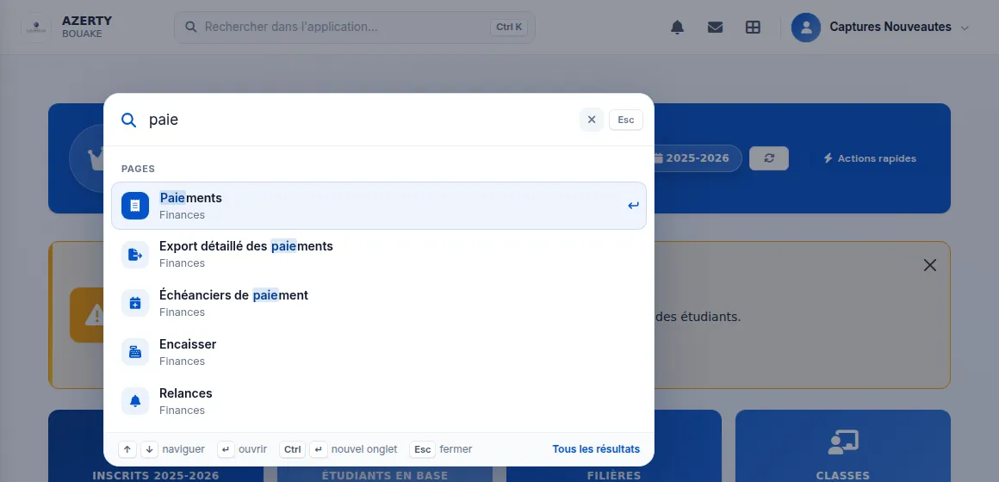
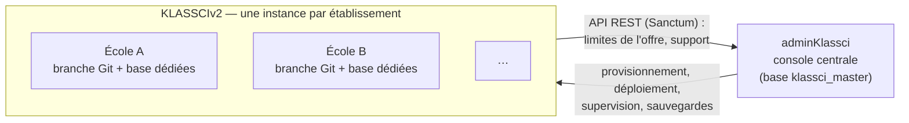

# KLASSCI

Logiciel de gestion d'établissement d'enseignement supérieur : inscriptions, scolarité, notes et bulletins, emploi du temps, présences, comptabilité et caisse, dans une seule application.

KLASSCI est livré en SaaS **multi-instance** : chaque établissement a sa propre application et sa propre base de données, isolées des autres, et toutes sont pilotées depuis une console centrale. Il gère les deux systèmes académiques en usage dans la sous-région : le **BTS** (matières, coefficients, moyenne générale) et le **LMD** selon le cadre UEMOA (unités d'enseignement, éléments constitutifs, crédits, compensation, jurys de délibération).

Documentation utilisateur et journal des nouveautés : [klassci.com/docs](https://klassci.com/docs).



*La recherche globale (Ctrl K) : les pages et les fiches de l'établissement, depuis n'importe quel écran.*

---

## Modules

Chaque module s'active par établissement, selon son offre. À l'intérieur, ce que voit chaque personne dépend de ses permissions : l'école crée ses propres rôles et coche les droits de chacun.

### Inscriptions et admissions
- Candidatures en ligne et demandes de réinscription traitées dans une seule file, de la demande à l'inscription.
- Inscription, affectation en classe, réinscription individuelle ou groupée.
- Frais par filière, niveau et année, échéanciers de paiement, bourses.
- Vérification des adresses e-mail et des téléphones saisis par les familles.

### Rendez-vous d'inscription
- Créneaux ouverts au public, réservation en ligne et convocation par e-mail avec suivi de la remise.
- Accueil du jour, feuille de suivi à imprimer, recherche d'un rendez-vous par nom, téléphone ou référence.

### Scolarité
- Filières, niveaux, classes, matières et maquettes (BTS et LMD : domaines, mentions, parcours, UE et ECUE).
- Fiche étudiant complète : parcours, résultats, situation financière, documents officiels (certificats, attestations).
- Pilotage académique : classes dont les notes sont complètes, notes manquantes, enseignants à relancer.

### Notes, bulletins et jurys
- Évaluations, saisie des notes, moyennes recalculées à chaque modification.
- Bulletins BTS configurables et générés en PDF, par étudiant ou par classe.
- LMD : notes par ECUE, compensation, crédits, sessions de rattrapage, examens avec anonymat des copies.
- Jurys de délibération LMD : composition, décisions calculées puis ajustées avec motif, procès-verbal numéroté.

### Emploi du temps et émargement
- Emplois du temps par classe, séances de cours, disponibilités des enseignants, détection des conflits.
- Émargement des enseignants par code, avec délais réglables par l'école, demandes de prolongation de cours.
- Suivi des heures prévues et réalisées (cours magistraux, travaux dirigés, travaux pratiques).

### Présences
- Appel par séance, absences et retards, justifications, avis aux familles.

### Comptabilité et caisse
- Encaissement guidé, reçus, annulation d'un versement par avoir, caisse du jour avec clôture et bordereau.
- Relances des impayés, journal de caisse, exports PDF et Excel.
- Réconciliation entre les paiements enregistrés et la caisse physique, avec approbation par une seconde personne et procès-verbal.
- Tableaux de bord comptables et analyse financière : encaissements, ancienneté des impayés, prévisions.

### Personnel
- Enseignants, personnel administratif, rôles personnalisés et permissions.
- Activité du personnel tirée du journal d'audit, paie des vacataires sur les heures faites.

### Communication
- Annonces, messagerie interne, notifications.

### Assistant Nanan
- Assistant intégré qui répond aux questions sur les données de l'établissement (retards de paiement, effectifs, notes) en montrant ses étapes.
- Il peut préparer une action, par exemple une saisie de notes à partir d'un fichier Excel ou d'une phrase, que la personne valide avant enregistrement.

### Transverse
- Journal d'audit lisible (« qui a fait quoi, sur quel dossier »), corbeille restaurable.
- Interface pensée pour le téléphone autant que pour l'ordinateur.

---

## Architecture

KLASSCI repose sur deux applications et deux dépôts.



- **KLASSCIv2** (ce dépôt) : l'application métier. Une seule base de code, déployée une fois par établissement. Chaque instance a sa branche Git du même nom que son code (`presentation` est la branche de développement, les autres en sont des copies synchronisées) et sa propre base MySQL. La personnalisation passe par le `.env` et les réglages en base, jamais par du code propre à une école.
- **adminKlassci** (dépôt séparé) : provisionne les instances, les déploie, surveille leur santé, gère les offres et le portail des groupes d'établissements.

Le préfixe `ESBTP` des modèles et des tables (`ESBTPEtudiant`, `esbtp_inscriptions`…) est un héritage du premier établissement équipé ; il ne désigne pas le produit.

### Stack

| | |
|---|---|
| Langage | PHP 8.3 |
| Framework | Laravel 9 (`composer.lock` : 9.52) |
| Base de données | MySQL 8 |
| Interface | Blade, Alpine.js, Bootstrap 5, Chart.js |
| PDF | DomPDF |
| Excel | Maatwebsite Excel |
| Droits | spatie/laravel-permission, registre dans `config/permissions.php` |
| API | Laravel Sanctum (API CLI d'exploitation, API LMS) |
| Assistant | Claude, modèles compatibles OpenAI, Gemini — voir `config/assistant.php` |

---

## Démarrer en local

### Prérequis
- PHP 8.3 avec les extensions habituelles de Laravel (`pdo_mysql`, `mbstring`, `gd`, `zip`, `intl`)
- Composer 2
- MySQL 8 (ou MariaDB)

### Installation

```bash
git clone https://github.com/James10192/KLASSCIv2.git
cd KLASSCIv2
git checkout presentation

# 1. Hooks du dépôt — obligatoire avant tout commit (voir plus bas)
sh .githooks/install.sh

# 2. Dépendances
composer install

# 3. Environnement
cp .env.example .env
php artisan key:generate
```

`.env.example` ne contient que les clés des intégrations (MailPulse, assistant, console centrale). Ajoutez vous-même au `.env` l'application et la connexion à la base :

```env
APP_NAME=KLASSCI
APP_ENV=local
APP_DEBUG=true
APP_URL=http://localhost:8000

DB_CONNECTION=mysql
DB_HOST=127.0.0.1
DB_PORT=3306
DB_DATABASE=klassci_local
DB_USERNAME=root
DB_PASSWORD=

TENANT_CODE=local
```

```bash
# 4. Base de données
php artisan migrate

# 5. Rôles et permissions, lus depuis config/permissions.php
php bin/deploy/fix_permissions.php

# 6. Lancer
php artisan serve
```

Tant qu'aucun utilisateur n'a le rôle `superAdmin`, le middleware `CheckInstalled` redirige toutes les pages vers l'assistant `/install`. Ouvrez-le pour créer le premier compte administrateur : il écrit lui-même `APP_INSTALLED=true` dans le `.env`, et `/install` se ferme dès que ce drapeau, la base et un superAdmin sont réunis. Si vous créez l'administrateur autrement (seeder, tinker), posez `APP_INSTALLED=true` à la main, sinon l'assistant reste ouvert.

### Hooks Git

`sh .githooks/install.sh` pointe Git vers `.githooks/`. Sans cela, aucun contrôle ne s'exécute sur votre poste. Les hooks refusent :
- les messages de commit non conventionnels et toute signature d'outil ;
- un `feat` ou un `fix` qui touche `app/`, `resources/`, `routes/` ou `database/` sans entrée dans `CHANGELOG.md` ;
- quatre pièges Blade qui compilent sans erreur mais cassent la page au rendu (détail dans `.claude/rules/blade-pitfalls.md`). Aucun contrôle côté serveur ne les rejoue : `--no-verify` les laisse partir en production.

### Tests

```bash
php artisan test --filter=NomDuTest     # ou : vendor/bin/phpunit
composer ci                             # rejoue la CI en local, sur une MariaDB isolée
```

À savoir avant de lancer la suite :
- `.env.testing` pointe sur une base MySQL **`klassci_testing`** (et non SQLite). Créez-la avant la première exécution : `CREATE DATABASE klassci_testing;`.
- Les tests `RefreshDatabase` migrent tout le schéma à chaque exécution : préférez un filtre large à plusieurs exécutions successives.
- Le middleware `CheckInstalled` est global. Un test de fonctionnalité qui appelle une route doit soit créer un utilisateur `superAdmin` dans son `setUp()`, soit désactiver le middleware (`withoutMiddleware([CheckInstalled::class, ...])`), faute de quoi toutes les réponses sont des redirections vers `/install`. `APP_INSTALLED=true` ne suffit pas à lui seul : le middleware exige un superAdmin en base.
- Deux exécutions simultanées sur `klassci_testing` se bloquent mutuellement (verrous InnoDB). Une seule à la fois.

---

## Où trouver le reste

| Sujet | Emplacement |
|---|---|
| Historique des changements | [`CHANGELOG.md`](CHANGELOG.md) |
| API REST et API CLI d'exploitation | [`docs/api/`](docs/api/) |
| Index de la documentation technique | [`docs/README.md`](docs/README.md) |
| Conventions de version et notes de version | [`docs/VERSIONING.md`](docs/VERSIONING.md) |
| Règles de développement (permissions, design, pièges connus) | [`.claude/rules/`](.claude/rules/) |
| Consignes générales du dépôt | [`CLAUDE.md`](CLAUDE.md) |
| Documentation utilisateur publique | [klassci.com/docs](https://klassci.com/docs) |
