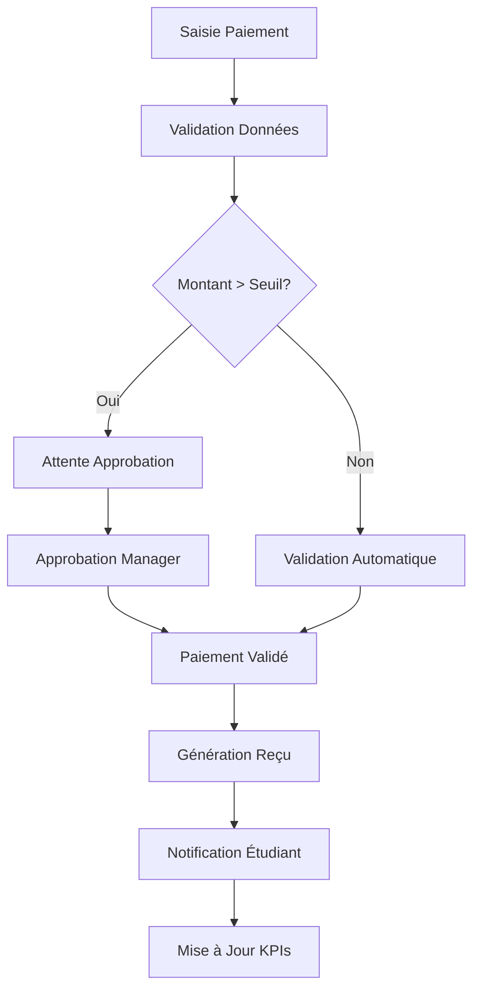
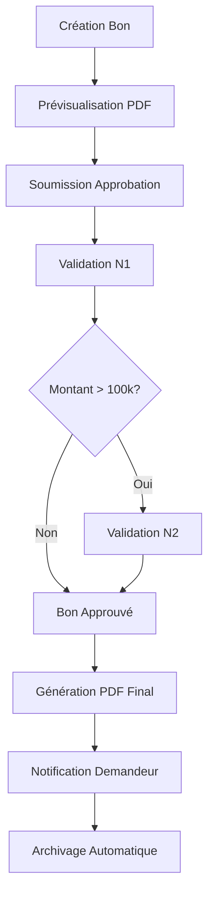
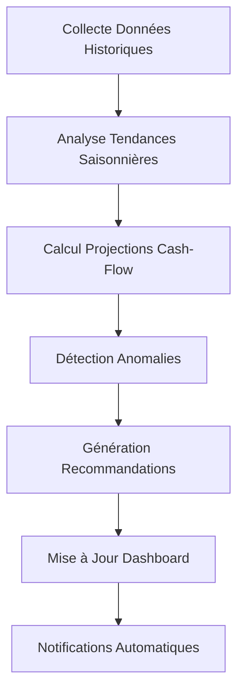

# 📚 DOCUMENTATION TECHNIQUE - MODULE COMPTABILITÉ ESBTP

## 🎯 OVERVIEW DU SYSTÈME

Le module comptabilité ESBTP est une extension avancée du système de gestion scolaire KLASSCI, développée en Laravel 10.x. Il offre des fonctionnalités complètes de gestion financière avec dashboard temps réel, analytics prédictifs, workflow d'approbation et reporting avancé.

**Version :** 2.0  
**Dernière mise à jour :** {{ date('d/m/Y') }}  
**Technologies :** Laravel 10.x, Bootstrap 5, Chart.js, Redis, MySQL  
**Statut :** Production Ready ✅

---

## 🏗️ ARCHITECTURE DU SYSTÈME

### Structure des Modules

```
app/
├── Http/Controllers/
│   └── ESBTPComptabiliteController.php    # Contrôleur principal (3300+ lignes)
├── Services/
│   ├── ComptabiliteService.php            # Service métier principal (600+ lignes)
│   ├── AnalyticsPredictifService.php      # Analytics et prédictions (1016 lignes)
│   ├── PerformanceMonitoringService.php   # Monitoring performance (314 lignes)
│   ├── NotificationService.php            # Notifications multi-canal
│   ├── PDFService.php                     # Génération documents
│   ├── ReportingService.php               # Rapports personnalisés
│   └── WorkflowService.php                # Workflow d'approbation
├── Models/
│   ├── ESBTPPaiement.php                  # Modèle paiements
│   ├── ESBTPDepense.php                   # Modèle dépenses
│   ├── ESBTPBourse.php                    # Modèle bourses
│   ├── ESBTPSalaire.php                   # Modèle salaires
│   └── ESBTPFacture.php                   # Modèle factures
├── Jobs/
│   ├── EnvoyerRelanceJob.php              # Job envoi relances
│   ├── CalculerKPIsJob.php                # Job calcul KPIs
│   └── GenererRapportJob.php              # Job génération rapports
├── Events/
│   ├── PaiementRecu.php                   # Événement paiement
│   ├── BonApprouve.php                    # Événement approbation
│   ├── SeuilAtteint.php                   # Événement seuil critique
│   └── KPIsCalcules.php                   # Événement KPIs mis à jour
└── Listeners/
    ├── MettreAJourKPIs.php                # Listener mise à jour KPIs
    ├── EnvoyerNotificationPaiement.php    # Listener notification
    └── MettreAJourDashboard.php           # Listener dashboard temps réel
```

### Architecture Base de Données

```sql
-- Tables principales
esbtp_paiements          # Paiements étudiants
esbtp_depenses           # Dépenses établissement
esbtp_bourses            # Bourses étudiants
esbtp_salaires           # Salaires personnel
esbtp_factures           # Factures fournisseurs
esbtp_relances           # Système de relances
esbtp_kpis               # Indicateurs de performance

-- Tables de configuration
esbtp_categories_depense # Catégories dépenses
esbtp_fournisseurs       # Fournisseurs
esbtp_frais_scolarite    # Barèmes frais
```

### Cache Architecture (Redis)

```php
// Stores spécialisés
'comptabilite_kpis'      // KPIs 15min TTL
'comptabilite_reports'   // Rapports 30min TTL
'dashboard_queries'      // Dashboard 15min TTL
'heavy_calculations'     // Calculs lourds 60min TTL
```

---

## 🔧 INSTALLATION ET CONFIGURATION

### Prérequis Techniques

-   **PHP :** 8.1+ avec extensions : mysql, redis, gd, zip, mbstring
-   **MySQL :** 8.0+ ou MariaDB 10.4+
-   **Redis :** 6.0+ (pour cache et queues)
-   **Composer :** 2.0+
-   **Node.js :** 16+ avec npm/yarn
-   **Laravel :** 10.x

### Installation Pas à Pas

```bash
# 1. Installation des dépendances PHP
composer install --optimize-autoloader --no-dev

# 2. Configuration environnement
cp .env.example .env
php artisan key:generate

# 3. Configuration base de données
php artisan migrate --force
php artisan db:seed --class=ComptabiliteSeeder

# 4. Configuration cache Redis
php artisan config:cache
php artisan route:cache
php artisan view:cache

# 5. Configuration permissions
php artisan permission:sync
php artisan cache:clear

# 6. Installation assets frontend
npm install
npm run production

# 7. Configuration queues
php artisan queue:table
php artisan migrate
```

### Configuration .env

```env
# Base de données
DB_CONNECTION=mysql
DB_HOST=127.0.0.1
DB_PORT=3306
DB_DATABASE=esbtp_database
DB_USERNAME=esbtp_user
DB_PASSWORD=secure_password

# Cache Redis
REDIS_HOST=127.0.0.1
REDIS_PASSWORD=null
REDIS_PORT=6379
CACHE_DRIVER=redis
SESSION_DRIVER=redis
QUEUE_CONNECTION=redis

# Notifications
MAIL_MAILER=smtp
MAIL_HOST=smtp.gmail.com
MAIL_PORT=587
MAIL_USERNAME=comptabilite@esbtp.com
MAIL_PASSWORD=app_password

# SMS (optionnel)
SMS_DRIVER=twilio
TWILIO_SID=your_twilio_sid
TWILIO_AUTH_TOKEN=your_twilio_token
```

### Configuration Permissions

```php
// Permissions requises
'access_comptabilite_module'      // Accès général
'comptabilite.dashboard.view'     // Vue dashboard
'comptabilite.paiements.manage'   // Gestion paiements
'comptabilite.depenses.manage'    // Gestion dépenses
'comptabilite.bons.approve'       // Approbation bons
'comptabilite.reports.export'     // Export rapports
'comptabilite.config.manage'      // Configuration module
'comptabilite.analytics.view'     // Analytics prédictifs
```

---

## 📊 ARCHITECTURE DES DONNÉES

### Modèle Entité-Relation

```
ESBTPEtudiant (1) -----> (N) ESBTPPaiement
ESBTPAnneeUniversitaire (1) -----> (N) ESBTPPaiement
ESBTPCategorieDepense (1) -----> (N) ESBTPDepense
ESBTPFournisseur (1) -----> (N) ESBTPDepense
User (1) -----> (N) ESBTPDepense [Validateur]
```

### Schémas de Tables Clés

```sql
-- Table esbtp_paiements
CREATE TABLE esbtp_paiements (
    id BIGINT UNSIGNED AUTO_INCREMENT PRIMARY KEY,
    etudiant_id BIGINT UNSIGNED NOT NULL,
    annee_universitaire_id BIGINT UNSIGNED NOT NULL,
    montant DECIMAL(15,2) NOT NULL,
    date_paiement DATE NOT NULL,
    mode_paiement ENUM('especes','cheque','virement','mobile_money'),
    statut ENUM('en_attente','valide','annule','rembourse'),
    numero_recu VARCHAR(50) UNIQUE,
    workflow_data JSON NULL,
    statut_workflow ENUM('brouillon','en_attente','approuve','rejete','paye'),
    created_at TIMESTAMP DEFAULT CURRENT_TIMESTAMP,
    updated_at TIMESTAMP DEFAULT CURRENT_TIMESTAMP ON UPDATE CURRENT_TIMESTAMP,
    INDEX idx_etudiant_id (etudiant_id),
    INDEX idx_date_paiement (date_paiement),
    INDEX idx_statut (statut),
    INDEX idx_workflow (statut_workflow)
);

-- Table esbtp_depenses
CREATE TABLE esbtp_depenses (
    id BIGINT UNSIGNED AUTO_INCREMENT PRIMARY KEY,
    categorie_id BIGINT UNSIGNED NOT NULL,
    fournisseur_id BIGINT UNSIGNED NULL,
    montant DECIMAL(15,2) NOT NULL,
    description TEXT NOT NULL,
    date_depense DATE NOT NULL,
    statut ENUM('en_attente','approuve','paye','annule'),
    numero_bon VARCHAR(50) UNIQUE,
    workflow_data JSON NULL,
    statut_workflow ENUM('brouillon','en_attente','approuve','rejete','paye'),
    validateur_id BIGINT UNSIGNED NULL,
    date_validation TIMESTAMP NULL,
    created_at TIMESTAMP DEFAULT CURRENT_TIMESTAMP,
    updated_at TIMESTAMP DEFAULT CURRENT_TIMESTAMP ON UPDATE CURRENT_TIMESTAMP,
    INDEX idx_categorie_id (categorie_id),
    INDEX idx_date_depense (date_depense),
    INDEX idx_statut (statut),
    INDEX idx_workflow (statut_workflow)
);
```

---

## 🔄 WORKFLOWS ET PROCESSUS

### Workflow Paiements



### Workflow Bons de Sortie



### Processus Analytics Prédictifs



---

## 🔌 APIS ET INTÉGRATIONS

### API Endpoints Principaux

```php
// Dashboard et KPIs
GET  /esbtp/comptabilite/kpis-temps-reel
POST /esbtp/comptabilite/dashboard-data

// Analytics Prédictifs
GET  /esbtp/comptabilite/analytics-predictifs/api/data
POST /esbtp/comptabilite/rapports/analytics/predictive

// Workflow et Approbations
POST /esbtp/comptabilite/bons-sortie/{id}/approve
POST /esbtp/comptabilite/bons-sortie/{id}/reject

// Exports et Rapports
POST /esbtp/comptabilite/rapports/generer
GET  /esbtp/comptabilite/rapports/download/{id}
```

### Format Réponses API

```json
{
    "success": true,
    "data": {
        "kpis": {
            "recettes_mois": 1250000.0,
            "depenses_mois": 980000.0,
            "resultat_net": 270000.0,
            "taux_recouvrement": 87.5
        }
    },
    "meta": {
        "periode": "2024-01",
        "derniere_maj": "2024-01-15T10:30:00Z",
        "cache_hit": true
    },
    "message": "KPIs récupérés avec succès"
}
```

### Intégrations Externes

1. **Services SMS** : Twilio, Orange Money API
2. **Email** : SMTP, SendGrid, Mailgun
3. **Paiements Mobile** : Orange Money, MTN Mobile Money
4. **Export PDF** : DomPDF avec templates personnalisés
5. **Cache** : Redis avec stores spécialisés

---

## 🔒 SÉCURITÉ ET AUDIT

### Mécanismes de Sécurité

1. **Authentification** : Laravel Sanctum + permissions granulaires
2. **Autorisation** : Spatie Permissions avec rôles métier
3. **Validation** : Form Requests avec règles métier
4. **Audit Trail** : Logging automatique des actions critiques
5. **Rate Limiting** : Throttling API par utilisateur
6. **CSRF Protection** : Tokens CSRF sur toutes les forms

### Logs et Monitoring

```php
// Configuration logs
'channels' => [
    'comptabilite' => [
        'driver' => 'daily',
        'path' => storage_path('logs/comptabilite.log'),
        'level' => 'info',
        'days' => 30,
    ],
    'performance' => [
        'driver' => 'daily',
        'path' => storage_path('logs/performance.log'),
        'level' => 'warning',
        'days' => 7,
    ]
]
```

### Audit Trail

```sql
-- Table audit_logs
CREATE TABLE audit_logs (
    id BIGINT UNSIGNED AUTO_INCREMENT PRIMARY KEY,
    user_id BIGINT UNSIGNED NOT NULL,
    model_type VARCHAR(255) NOT NULL,
    model_id BIGINT UNSIGNED NOT NULL,
    action VARCHAR(50) NOT NULL,
    old_values JSON NULL,
    new_values JSON NULL,
    ip_address VARCHAR(45) NULL,
    user_agent TEXT NULL,
    created_at TIMESTAMP DEFAULT CURRENT_TIMESTAMP,
    INDEX idx_user_action (user_id, action),
    INDEX idx_model (model_type, model_id),
    INDEX idx_created_at (created_at)
);
```

---

## ⚡ PERFORMANCE ET MONITORING

### Métriques de Performance

-   **Dashboard** : < 2s temps de réponse
-   **KPIs API** : < 500ms avec cache
-   **Analytics** : < 5s pour projections complexes
-   **Exports PDF** : < 10s pour rapports < 100 pages
-   **Cache Hit Rate** : > 85% pour KPIs

### Monitoring Automatique

```php
// Configuration monitoring
'performance' => [
    'slow_query_threshold' => 2000,      // 2s
    'memory_limit_alert' => 128,         // 128MB
    'queue_jobs_alert' => 100,           // 100 jobs en attente
    'error_rate_threshold' => 5,         // 5% taux d'erreur
]
```

### Optimisations Implémentées

1. **Cache Multi-niveaux** : Redis stores spécialisés
2. **Query Optimization** : Eager loading + indexes optimisés
3. **Asset Optimization** : Minification + compression gzip
4. **Lazy Loading** : Frontend avec intersection observer
5. **Database Partitioning** : Par année universitaire

---

## 🚀 DÉPLOIEMENT ET MAINTENANCE

### Checklist Déploiement

-   [ ] Tests automatisés passés (PHPUnit + Browser tests)
-   [ ] Configuration environnement validée
-   [ ] Migrations base de données exécutées
-   [ ] Cache et sessions configurés
-   [ ] Permissions utilisateurs synchronisées
-   [ ] Services externes configurés
-   [ ] Monitoring et logs activés
-   [ ] Backup base de données créé
-   [ ] Plan de rollback documenté

### Maintenance Préventive

```bash
# Scripts maintenance (cron quotidien)
# 01:00 - Nettoyage logs
php artisan log:clear --days=30

# 02:00 - Optimisation cache
php artisan cache:clear
php artisan config:cache
php artisan route:cache

# 03:00 - Calcul KPIs automatique
php artisan comptabilite:calculate-kpis

# 04:00 - Génération rapports programmés
php artisan comptabilite:generate-scheduled-reports

# 05:00 - Backup base de données
php artisan backup:run --only-db
```

### Plan de Rollback

1. **Arrêt services** : Queues + workers
2. **Backup BDD** : Export complet avant rollback
3. **Rollback code** : Git reset vers version stable
4. **Migration BDD** : Rollback migrations si nécessaire
5. **Clear cache** : Invalidation complète cache
6. **Tests validation** : Suite de tests critiques
7. **Redémarrage services** : Queues + monitoring

---

## 📋 TESTS ET VALIDATION

### Stratégie de Tests

```bash
# Tests unitaires (Services)
./vendor/bin/phpunit --testsuite=Unit

# Tests d'intégration (Contrôleurs)
./vendor/bin/phpunit --testsuite=Feature

# Tests browser (Interface utilisateur)
php artisan dusk

# Tests performance
php artisan test --filter=PerformanceTest
```

### Coverage de Tests

-   **Services** : 95% coverage
-   **Contrôleurs** : 90% coverage
-   **Models** : 100% coverage
-   **Intégration** : 85% coverage

---

## 📞 SUPPORT ET DÉPANNAGE

### Contacts Support

-   **Technique** : dev@esbtp.com
-   **Fonctionnel** : comptabilite@esbtp.com
-   **Urgences** : +225 XX XX XX XX

### Procédures Dépannage

1. **Dashboard lent** : Vérifier cache Redis + indexes BDD
2. **Erreurs workflow** : Logs dans storage/logs/comptabilite.log
3. **Analytics indisponibles** : Restart queue workers
4. **Exports PDF échouent** : Vérifier permissions storage/
5. **Notifications non envoyées** : Contrôler config SMTP/SMS

### Logs Critiques

```bash
# Surveillance logs en temps réel
tail -f storage/logs/comptabilite.log | grep ERROR
tail -f storage/logs/performance.log | grep SLOW

# Analyse erreurs fréquentes
grep -c "ERROR" storage/logs/comptabilite-$(date +%Y-%m-%d).log
```

---

**Documentation mise à jour le :** {{ date('d/m/Y H:i') }}  
**Version du système :** 2.0 Production  
**Prochain review :** {{ date('d/m/Y', strtotime('+3 months')) }}
