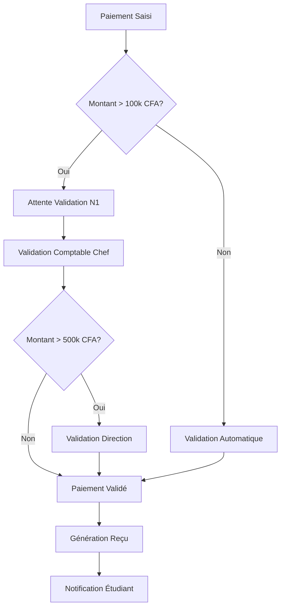
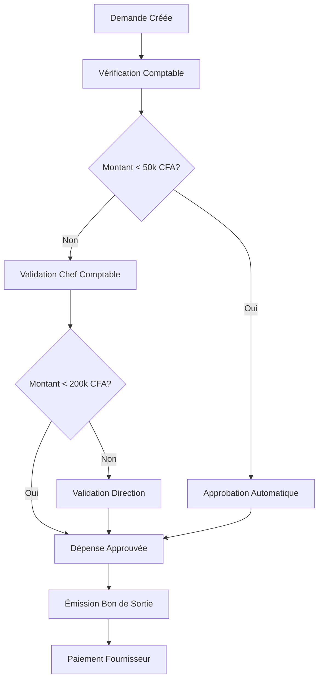

# 💼 GUIDE UTILISATEUR COMPTABLE - MODULE COMPTABILITÉ ESBTP

## 🎯 PRÉSENTATION DU GUIDE

Ce guide est destiné aux **comptables et responsables financiers** utilisant quotidiennement le module comptabilité ESBTP. Formation recommandée : **2 heures**.

**Public cible :** Comptables, responsables financiers, personnel comptabilité  
**Prérequis :** Connaissances comptables de base  
**Durée formation :** 2h (1h théorie + 1h pratique)

---

## 📋 TABLE DES MATIÈRES

1. [Première connexion](#première-connexion)
2. [Navigation et interface](#navigation-et-interface)
3. [Gestion des paiements](#gestion-des-paiements)
4. [Gestion des dépenses](#gestion-des-dépenses)
5. [Workflow bons de sortie](#workflow-bons-de-sortie)
6. [Dashboard et KPIs](#dashboard-et-kpis)
7. [Analytics prédictifs](#analytics-prédictifs)
8. [Rapports et exports](#rapports-et-exports)
9. [Bonnes pratiques](#bonnes-pratiques)
10. [FAQ et dépannage](#faq-et-dépannage)

---

## 🔐 PREMIÈRE CONNEXION

### Accès au Système

1. **URL de connexion :** `https://esbtp.local/login`
2. **Identifiants :** Fournis par l'administrateur
3. **Changement mot de passe obligatoire** à la première connexion

### Interface de Connexion

```
┌─────────────────────────────────┐
│         ESBTP - Connexion       │
├─────────────────────────────────┤
│ Email    : [________________]   │
│ Mot de passe : [____________]   │
│ [ ] Se souvenir de moi          │
│                                 │
│        [Se Connecter]           │
└─────────────────────────────────┘
```

### Première Configuration

1. **Changement mot de passe**

    - Minimum 8 caractères
    - Majuscules + minuscules + chiffres
    - Caractère spécial recommandé

2. **Configuration profil**
    - Photo de profil (optionnel)
    - Préférences d'affichage
    - Notifications email/SMS

---

## 🗺️ NAVIGATION ET INTERFACE

### Menu Principal

```
📊 Dashboard
├── 📈 Dashboard Avancé
├── 📊 KPIs Temps Réel
└── 🔍 Analytics Prédictifs

💰 Paiements
├── 📝 Saisie Paiements
├── 📋 Liste Paiements
├── 🔄 Validation Paiements
└── 📧 Relances Automatiques

💸 Dépenses
├── 📝 Saisie Dépenses
├── 📋 Liste Dépenses
├── ✅ Approbations
└── 📄 Bons de Sortie

📊 Rapports
├── 🏗️ Générateur Rapports
├── 📈 Rapports Prédéfinis
├── 📊 Analytics Avancés
└── 📤 Exports

⚙️ Configuration
├── 🏷️ Catégories
├── 👥 Fournisseurs
└── 📋 Frais Scolarité
```

### Barre d'Outils Rapide

-   **🔔 Notifications** : Alertes temps réel
-   **🔍 Recherche Globale** : Recherche transactions
-   **👤 Profil** : Paramètres utilisateur
-   **❓ Aide** : Documentation contextuelle

---

## 💰 GESTION DES PAIEMENTS

### Saisie Nouveau Paiement

**Accès :** `Paiements > Saisie Paiements`

#### Étapes de Saisie

1. **Sélection Étudiant**

    ```
    ┌─────────────────────────────────────┐
    │ Recherche Étudiant                  │
    ├─────────────────────────────────────┤
    │ Nom/Prénom : [________________]     │
    │ Matricule  : [________________]     │
    │ Classe     : [Licence 1 Info ▼]    │
    │                                     │
    │ Résultats :                         │
    │ □ KOUASSI Marie - L1INFO - MAT001   │
    │ □ DIALLO Amadou - L1INFO - MAT002   │
    └─────────────────────────────────────┘
    ```

2. **Détails du Paiement**

    ```
    ┌─────────────────────────────────────┐
    │ Informations Paiement               │
    ├─────────────────────────────────────┤
    │ Montant      : [________] CFA       │
    │ Date         : [2024-01-15]         │
    │ Mode         : [Espèces ▼]          │
    │ Référence    : [________________]   │
    │ Motif        : [Frais scolarité ▼]  │
    │ Commentaire  : [________________]   │
    │                                     │
    │     [Aperçu Reçu] [Enregistrer]     │
    └─────────────────────────────────────┘
    ```

3. **Validation et Impression**
    - Vérification des données saisies
    - Génération automatique du reçu
    - Impression ou envoi par email

#### Modes de Paiement Disponibles

-   **Espèces** : Paiement liquide
-   **Chèque** : Avec numéro et banque
-   **Virement** : Référence bancaire
-   **Mobile Money** : Orange/MTN Money
-   **Carte Bancaire** : Terminal de paiement

### Validation des Paiements

**Accès :** `Paiements > Validation Paiements`

#### Workflow de Validation



#### Interface de Validation

```
┌─────────────────────────────────────────────────────────┐
│ Paiements en Attente de Validation                      │
├─────────────────────────────────────────────────────────┤
│ □ KOUASSI Marie - 250,000 CFA - 15/01/2024            │
│   Frais inscription L2 - Chèque n°123456               │
│   [Valider] [Rejeter] [Détails]                        │
│                                                         │
│ □ DIALLO Amadou - 150,000 CFA - 15/01/2024            │
│   Frais scolarité S1 - Mobile Money                    │
│   [Valider] [Rejeter] [Détails]                        │
├─────────────────────────────────────────────────────────┤
│ [Validation Groupée] [Exporter Liste]                  │
└─────────────────────────────────────────────────────────┘
```

### Gestion des Relances

**Accès :** `Paiements > Relances Automatiques`

#### Configuration Campagne de Relance

```
┌─────────────────────────────────────────┐
│ Nouvelle Campagne de Relance            │
├─────────────────────────────────────────┤
│ Nom        : [Relance T1 2024]          │
│ Type       : [Email + SMS ▼]            │
│ Cible      : [Tous impayés ▼]           │
│ Seuil      : [30] jours                 │
│ Planif.    : [2024-01-20 09:00]         │
│                                         │
│ Template   : [Template Standard ▼]      │
│                                         │
│ [Aperçu] [Programmer] [Envoyer]         │
└─────────────────────────────────────────┘
```

#### Suivi des Relances

-   **Statistiques d'envoi** : Nombre d'emails/SMS envoyés
-   **Taux de réponse** : Paiements suite à relance
-   **Efficacité par canal** : Email vs SMS vs Courrier
-   **Historique des envois** : Log complet des relances

---

## 💸 GESTION DES DÉPENSES

### Saisie Nouvelle Dépense

**Accès :** `Dépenses > Saisie Dépenses`

#### Formulaire de Saisie

```
┌─────────────────────────────────────────┐
│ Nouvelle Dépense                        │
├─────────────────────────────────────────┤
│ Catégorie   : [Fournitures ▼]           │
│ Fournisseur : [SODECI ▼]                │
│ Montant     : [________] CFA            │
│ Date        : [2024-01-15]              │
│ Description : [________________________] │
│ Facture N°  : [FAC-2024-001]           │
│                                         │
│ Pièces jointes :                        │
│ [📎 Ajouter fichier]                    │
│                                         │
│ [Brouillon] [Soumettre Approbation]    │
└─────────────────────────────────────────┘
```

#### Catégories de Dépenses

-   **Fournitures Bureau** : Papeterie, matériel informatique
-   **Utilities** : Électricité, eau, internet, téléphone
-   **Maintenance** : Réparations, entretien équipements
-   **Personnel** : Salaires, charges sociales, formations
-   **Marketing** : Publicité, communication, événements
-   **Transport** : Carburant, transport personnel
-   **Autres** : Dépenses diverses

### Workflow d'Approbation

#### Circuit d'Approbation Standard



#### Interface d'Approbation

```
┌─────────────────────────────────────────────────────────┐
│ Dépenses en Attente d'Approbation                       │
├─────────────────────────────────────────────────────────┤
│ DEP-2024-001 - SODECI - 85,000 CFA                     │
│ Facture électricité bureau - 15/01/2024                │
│ Demandeur: Marie KOUASSI                                │
│ [👁️ Voir] [✅ Approuver] [❌ Rejeter] [💬 Commenter]     │
│                                                         │
│ DEP-2024-002 - ORANGE - 45,000 CFA                     │
│ Abonnement internet mensuel - 15/01/2024               │
│ Demandeur: Paul DIALLO                                 │
│ [👁️ Voir] [✅ Approuver] [❌ Rejeter] [💬 Commenter]     │
└─────────────────────────────────────────────────────────┘
```

---

## 📄 WORKFLOW BONS DE SORTIE

### Création Bon de Sortie

**Accès :** `Dépenses > Bons de Sortie`

#### Interface de Création

```
┌─────────────────────────────────────────────────────────┐
│ Nouveau Bon de Sortie                                   │
├─────────────────────────────────────────────────────────┤
│ N° Bon      : [BON-2024-001] (auto)                    │
│ Date        : [2024-01-15]                              │
│ Bénéficiaire: [SODECI ▼]                               │
│ Objet       : [_________________________________]       │
│                                                         │
│ Détails:                                                │
│ ┌─────────────────────────────────────────────────────┐ │
│ │ Désignation      │ Qté │ PU      │ Montant         │ │
│ ├─────────────────────────────────────────────────────┤ │
│ │ Facture élec.    │  1  │ 85,000  │ 85,000 CFA     │ │
│ │ [+ Ajouter ligne]                                   │ │
│ └─────────────────────────────────────────────────────┘ │
│                                                         │
│ Total: 85,000 CFA                                       │
│                                                         │
│ [📄 Aperçu PDF] [💾 Brouillon] [📤 Soumettre]           │
└─────────────────────────────────────────────────────────┘
```

#### Prévisualisation Temps Réel

Le système génère automatiquement un aperçu PDF pendant la saisie :

-   **En-tête institutionnel** automatique
-   **Numérotation séquentielle** des bons
-   **QR Code de traçabilité** pour vérification
-   **Signatures électroniques** des approbateurs

### Suivi des Bons

#### Tableau de Bord Bons de Sortie

```
┌─────────────────────────────────────────────────────────┐
│ Mes Bons de Sortie                                      │
├─────────────────────────────────────────────────────────┤
│ BON-2024-001 │ SODECI    │ 85,000  │ ✅ Approuvé       │
│ BON-2024-002 │ ORANGE    │ 45,000  │ ⏳ En attente     │
│ BON-2024-003 │ Fourn. X  │ 125,000 │ 📋 Brouillon      │
│ BON-2024-004 │ Maint. Y  │ 65,000  │ ❌ Rejeté        │
├─────────────────────────────────────────────────────────┤
│ Filtres: [Tous ▼] [Cette semaine ▼] [🔍 Recherche]    │
└─────────────────────────────────────────────────────────┘
```

#### États des Bons

-   **📋 Brouillon** : En cours de rédaction
-   **⏳ En attente** : Soumis pour approbation
-   **✅ Approuvé** : Validé et prêt pour paiement
-   **💰 Payé** : Fournisseur payé
-   **❌ Rejeté** : Refusé avec commentaires
-   **🗃️ Archivé** : Processus terminé

---

## 📊 DASHBOARD ET KPIS

### Dashboard Principal

**Accès :** `Dashboard > Dashboard Avancé`

#### Vue d'Ensemble

```
┌─────────────────────────────────────────────────────────┐
│ 📈 KPIs Financiers - Janvier 2024                      │
├─────────────────────────────────────────────────────────┤
│ 💰 Recettes Mois    │ 🏦 Dépenses Mois   │ 📊 Résultat  │
│    1,250,000 CFA    │    980,000 CFA     │ +270,000 CFA │
│    +12% vs déc.     │    +5% vs déc.     │   Positif ✅  │
├─────────────────────────────────────────────────────────┤
│ 📈 Taux Recouvrement │ ⏰ Impayés        │ 🎯 Objectif  │
│      87.5%          │   156,000 CFA      │    90% ⚠️    │
│    +2.3% vs déc.    │   -15% vs déc.     │   Presque    │
└─────────────────────────────────────────────────────────┘

┌─────────────────────────────────────────────────────────┐
│ 📊 Graphiques Évolution (6 derniers mois)              │
├─────────────────────────────────────────────────────────┤
│        Recettes vs Dépenses                             │
│                                                         │
│ 1.5M ┤                                                 │
│ 1.2M ┤    ●─●─●                                        │
│ 0.9M ┤  ●─       ●─●                                   │
│ 0.6M ┤●           ▲─▲─▲                                 │
│ 0.3M ┤         ▲─▲                                     │
│   0  └──────────────────────────────────────────        │
│      Août Sept Oct Nov Déc Jan                          │
│      ● Recettes  ▲ Dépenses                            │
└─────────────────────────────────────────────────────────┘
```

#### Alertes Automatiques

```
┌─────────────────────────────────────────────────────────┐
│ 🚨 Alertes et Notifications                             │
├─────────────────────────────────────────────────────────┤
│ ⚠️  Taux recouvrement en baisse (87.5% < 90%)          │
│     Action: Lancer campagne relance intensive           │
│                                                         │
│ 🔔  15 paiements en attente validation > 48h           │
│     Action: Traiter les validations en attente          │
│                                                         │
│ 💡  Pic dépenses maintenance prévu en mars              │
│     Action: Prévoir budget supplémentaire               │
└─────────────────────────────────────────────────────────┘
```

### KPIs en Temps Réel

**Mise à jour automatique** : Toutes les 30 secondes via AJAX

#### Indicateurs Clés

1. **Financiers**

    - Recettes mensuelles et cumulées
    - Dépenses par catégorie
    - Résultat net et marge opérationnelle
    - Cash-flow prévisionnel

2. **Opérationnels**

    - Taux de recouvrement global et par filière
    - Délai moyen de paiement
    - Nombre de relances envoyées
    - Efficacité des relances

3. **Qualitatifs**
    - Délai moyen de traitement
    - Taux d'approbation première fois
    - Satisfaction utilisateurs
    - Conformité processus

---

## 🔮 ANALYTICS PRÉDICTIFS

### Accès et Navigation

**Accès :** `Dashboard > Analytics Prédictifs`

### Projections Cash-Flow

#### Interface Projections

```
┌─────────────────────────────────────────────────────────┐
│ 📈 Projections Cash-Flow - 6 prochains mois            │
├─────────────────────────────────────────────────────────┤
│ Période: [6 mois ▼] Confiance: 95%                     │
│                                                         │
│      Projections avec Intervalles de Confiance          │
│                                                         │
│ 1.5M ┤                                    ╭─╮           │
│ 1.2M ┤           ╭─╮     ╭─╮           ╭─╱   ╲─╮       │
│ 0.9M ┤        ╭─╱   ╲─╮ ╱   ╲─╮     ╭─╱       ╲─╮     │
│ 0.6M ┤     ╭─╱       ╲─╱       ╲─╮ ╱             ╲─╮   │
│ 0.3M ┤  ╭─╱                     ╲─╱                 ╲─╮ │
│   0  └──────────────────────────────────────────────────│
│      Fév  Mar  Avr  Mai  Jun  Jul                      │
│      ■ Projection ▓ Intervalle confiance               │
└─────────────────────────────────────────────────────────┘

Résumé Projections:
• Recettes moyennes projetées: 1.1M CFA/mois
• Tendance: +8% croissance annuelle
• Période critique: Avril-Mai (examens)
• Pic d'activité: Septembre-Octobre (rentrée)
```

#### Scénarios Prévisionnels

```
┌─────────────────────────────────────────────────────────┐
│ 🎭 Scénarios de Projection                              │
├─────────────────────────────────────────────────────────┤
│ Optimiste (15% prob.)  │ 1,350,000 CFA │ +18% croiss. │
│ Réaliste (70% prob.)   │ 1,150,000 CFA │ +8% croiss.  │
│ Pessimiste (15% prob.) │   950,000 CFA │ -2% déclin   │
├─────────────────────────────────────────────────────────┤
│ Facteurs d'influence:                                   │
│ • Saisonnalité: Fort impact sept-oct, fév-mars         │
│ • Économie locale: Impact modéré                       │
│ • Concurrence: 3 nouveaux établissements en 2024      │
└─────────────────────────────────────────────────────────┘
```

### Détection d'Anomalies

#### Interface Anomalies

```
┌─────────────────────────────────────────────────────────┐
│ 🔍 Anomalies Détectées - Derniers 30 jours             │
├─────────────────────────────────────────────────────────┤
│ 🔴 CRITIQUE │ Paiement 500k CFA - Étudiant X           │
│   15/01/24  │ Montant 5x supérieur à la normale        │
│   Actions:   [Vérifier] [Valider] [Investiguer]        │
│                                                         │
│ 🟡 MODÉRÉ   │ Pic dépenses maintenance +250%           │
│   12/01/24  │ Janvier: 85k vs moyenne 25k CFA          │
│   Actions:   [Justifier] [Budget] [Reporter]           │
│                                                         │
│ 🟢 FAIBLE   │ Retard validation 48h                    │
│   10/01/24  │ 15 paiements en attente                  │
│   Actions:   [Traiter] [Rappeler] [Déléguer]           │
└─────────────────────────────────────────────────────────┘

Statistiques Anomalies:
• Total détectées: 23 (derniers 30 jours)
• Critiques: 3 (13%) - Nécessitent action immédiate
• Modérées: 8 (35%) - À traiter sous 48h
• Faibles: 12 (52%) - Surveillance normale
```

### Recommandations Intelligentes

```
┌─────────────────────────────────────────────────────────┐
│ 💡 Recommandations Intelligentes                        │
├─────────────────────────────────────────────────────────┤
│ 🚀 PRIORITÉ HAUTE                                       │
│                                                         │
│ 1. Optimiser recouvrement Licence 1                    │
│    Impact: +125k CFA/mois (récupération 15% impayés)   │
│    Action: Campagne relance ciblée + échéanciers       │
│    Effort: 2 jours, ROI: 3 mois                        │
│                                                         │
│ 2. Renégocier contrat électricité                      │
│    Impact: -35k CFA/mois (réduction 20% facture)       │
│    Action: Contacter SODECI pour tarif professionnel   │
│    Effort: 1 semaine, ROI: Immédiat                    │
│                                                         │
│ 📊 PRIORITÉ MOYENNE                                     │
│                                                         │
│ 3. Automatiser rapprochement bancaire                  │
│    Impact: -8h/mois temps comptable                    │
│    Action: Connecter API banque + validation auto      │
│    Effort: 2 semaines, ROI: 6 mois                     │
└─────────────────────────────────────────────────────────┘
```

---

## 📊 RAPPORTS ET EXPORTS

### Générateur de Rapports

**Accès :** `Rapports > Générateur Rapports`

#### Interface Drag & Drop

```
┌─────────────────────────────────────────────────────────┐
│ 🏗️ Générateur de Rapports Personnalisés                │
├─────────────────────────────────────────────────────────┤
│ Composants Disponibles:     │ Rapport en Cours:         │
│                             │                           │
│ 📊 Données:                 │ ┌─────────────────────┐   │
│ [KPIs Financiers]           │ │ 📋 Titre Rapport    │   │
│ [Recettes/Dépenses]         │ │ ________________   │   │
│ [Étudiants Impayés]         │ └─────────────────────┘   │
│ [Performance Filières]      │                           │
│                             │ ← Glisser composants ici  │
│ 📈 Graphiques:              │                           │
│ [Évolution Temporelle]      │ ┌─────────────────────┐   │
│ [Répartition Secteurs]      │ │ 💰 KPIs Financiers  │   │
│ [Comparaison Périodes]      │ │ └─ Recettes: 1.2M   │   │
│                             │ │ └─ Dépenses: 980k   │   │
│ 🎨 Formatage:               │ │ └─ Résultat: +270k  │   │
│ [Saut de Page]              │ └─────────────────────┘   │
│ [En-tête/Pied Page]         │                           │
│ [Signature]                 │ [📄 Aperçu] [💾 Save]     │
└─────────────────────────────────────────────────────────┘
```

#### Types de Rapports Prédéfinis

1. **Rapport Mensuel Standard**

    - KPIs du mois vs objectifs
    - Évolution recettes/dépenses
    - Top 10 étudiants payeurs
    - Liste des impayés

2. **Rapport Trimestriel Direction**

    - Analyse performance globale
    - Projections trimestre suivant
    - Recommandations stratégiques
    - Indicateurs de risque

3. **Rapport Annuel Comptable**
    - Bilan financier annuel
    - Évolution année/année
    - Analyse par filière
    - Audit et conformité

### Exports Multi-formats

#### Formats Disponibles

```
┌─────────────────────────────────────────┐
│ 💾 Options d'Export                     │
├─────────────────────────────────────────┤
│ 📄 PDF                                  │
│   ├─ Standard (lecture écran)           │
│   ├─ Impression (optimisé papier)       │
│   └─ Archivage (PDF/A)                  │
│                                         │
│ 📊 Excel (.xlsx)                        │
│   ├─ Données brutes                     │
│   ├─ Avec graphiques                    │
│   └─ Tableau croisé dynamique           │
│                                         │
│ 📈 CSV                                  │
│   ├─ Données uniquement                 │
│   ├─ Avec en-têtes                      │
│   └─ Séparateur personnalisé            │
│                                         │
│ 🌐 Autres                               │
│   ├─ JSON (API)                         │
│   ├─ XML (intégration)                  │
│   └─ Email (envoi direct)               │
└─────────────────────────────────────────┘
```

#### Rapports Programmés

```
┌─────────────────────────────────────────────────────────┐
│ ⏰ Planification Rapports Automatiques                  │
├─────────────────────────────────────────────────────────┤
│ Rapport Mensuel Direction                               │
│ 📅 Tous les 1er du mois à 08:00                        │
│ 📧 Envoi: direction@esbtp.com                           │
│ 📄 Format: PDF + Excel                                  │
│ [✏️ Modifier] [⏸️ Pause] [🗑️ Supprimer]                 │
│                                                         │
│ KPIs Hebdomadaires                                      │
│ 📅 Tous les lundis à 09:00                             │
│ 📧 Envoi: equipe-comptabilite@esbtp.com                │
│ 📄 Format: Excel                                        │
│ [✏️ Modifier] [⏸️ Pause] [🗑️ Supprimer]                 │
├─────────────────────────────────────────────────────────┤
│ [➕ Nouveau Rapport Programmé]                          │
└─────────────────────────────────────────────────────────┘
```

---

## ✅ BONNES PRATIQUES

### Saisie des Données

#### Règles de Saisie

1. **Paiements**

    - Toujours vérifier l'identité de l'étudiant
    - Saisir le motif exact du paiement
    - Photographier le chèque si applicable
    - Imprimer le reçu immédiatement

2. **Dépenses**

    - Joindre systématiquement la facture
    - Vérifier la catégorie comptable
    - Demander 3 devis pour montants > 100k CFA
    - Valider la disponibilité budgétaire

3. **Validation**
    - Vérifier calculs avant validation
    - Laisser commentaires explicatifs
    - Traiter les validations sous 48h
    - Archiver les pièces justificatives

### Sécurité et Confidentialité

#### Règles de Sécurité

1. **Accès Système**

    - Ne jamais partager ses identifiants
    - Se déconnecter en fin de poste
    - Changer mot de passe tous les 3 mois
    - Signaler tentatives d'intrusion

2. **Données Financières**

    - Ne pas divulguer montants personnels
    - Limiter accès aux données nécessaires
    - Chiffrer exports contenant données sensibles
    - Respecter RGPD pour données personnelles

3. **Archivage**
    - Classer documents par année/mois
    - Scanner originaux pour backup
    - Respecter durées légales conservation
    - Protéger accès archives physiques

### Optimisation Workflow

#### Conseils d'Efficacité

1. **Organisation Quotidienne**

    - Traiter paiements par ordre de réception
    - Grouper validations par montant
    - Planifier relances en fin de semaine
    - Réserver créneaux pour rapports

2. **Utilisation des Outils**

    - Utiliser recherche globale fréquemment
    - Créer raccourcis pour actions répétitives
    - Exploiter filtres et tris des listes
    - Personnaliser dashboard selon besoins

3. **Communication Équipe**
    - Utiliser commentaires workflow
    - Signaler anomalies immédiatement
    - Partager bonnes pratiques
    - Documenter procédures spécifiques

---

## ❓ FAQ ET DÉPANNAGE

### Questions Fréquentes

#### Paiements

**Q: Que faire si un étudiant conteste un paiement ?**  
R: Vérifier l'historique complet dans `Paiements > Liste`, éditer un duplicata du reçu, et contacter le service scolarité si nécessaire.

**Q: Comment annuler un paiement validé ?**  
R: Seul un comptable chef peut annuler. Aller dans `Paiements > Liste`, sélectionner le paiement, cliquer "Actions" > "Annuler" avec justification.

**Q: Un paiement n'apparaît pas dans les KPIs ?**  
R: Vérifier que le statut est "Validé" et attendre la prochaine mise à jour (max 30 minutes) ou forcer via `Dashboard > Actualiser KPIs`.

#### Dépenses

**Q: Comment modifier une dépense déjà approuvée ?**  
R: Impossible de modifier directement. Créer une note de crédit ou nouvelle dépense de régularisation avec commentaire explicatif.

**Q: Le workflow d'approbation est bloqué ?**  
R: Vérifier que l'approbateur a les permissions nécessaires. Si le problème persiste, contacter l'administrateur pour déblocage manuel.

#### Rapports

**Q: L'export PDF est corrompu ?**  
R: Essayer d'abord l'export Excel, puis contact support si récurrent. Peut être dû à la taille du rapport (limite 100 pages).

**Q: Les données du rapport semblent incorrectes ?**  
R: Vérifier les filtres appliqués et la période sélectionnée. Force refresh du cache via `F5` ou contact support.

### Dépannage Courant

#### Problèmes de Performance

**Symptôme**: Dashboard lent à charger  
**Cause**: Cache Redis surchargé  
**Solution**:

1. Fermer/rouvrir navigateur
2. Vider cache navigateur (Ctrl+Shift+Del)
3. Si persistant: contacter support

**Symptôme**: Erreur lors de l'export  
**Cause**: Rapport trop volumineux  
**Solution**:

1. Réduire période de données
2. Supprimer graphiques complexes
3. Exporter en plusieurs parties

#### Problèmes de Connexion

**Symptôme**: Déconnexion fréquente  
**Cause**: Session expirée (120 min)  
**Solution**:

1. Cocher "Se souvenir de moi"
2. Sauvegarder travail régulièrement
3. Demander extension session à admin

**Symptôme**: Impossible de se connecter  
**Cause**: Compte bloqué ou mot de passe oublié  
**Solution**:

1. Vérifier CAPS LOCK
2. Utiliser "Mot de passe oublié"
3. Contacter admin si compte bloqué

### Support et Assistance

#### Contacts Support

**Support Technique**: support@esbtp.com  
**Support Fonctionnel**: comptabilite@esbtp.com  
**Urgences**: +225 XX XX XX XX

#### Procédure de Signalement

1. **Description problème**: Détailler étapes reproductibles
2. **Capture écran**: Joindre si erreur visuelle
3. **Informations contexte**: Navigateur, heure, utilisateur
4. **Priorité**: Urgente/Normale/Faible
5. **Contact**: Email + téléphone si urgent

---

## 📚 RESSOURCES COMPLÉMENTAIRES

### Formation Continue

-   **Session mensuelle**: Nouveautés et bonnes pratiques
-   **Documentation en ligne**: Mise à jour continue
-   **Forum utilisateurs**: Entraide communauté
-   **Webinaires trimestriels**: Formation approfondie

### Raccourcis Clavier

-   `Ctrl + K`: Recherche globale
-   `Ctrl + N`: Nouveau paiement
-   `Ctrl + D`: Dashboard principal
-   `Ctrl + R`: Rafraîchir données
-   `Ctrl + P`: Imprimer/Export PDF
-   `F1`: Aide contextuelle

### Liens Utiles

-   [Documentation technique complète](./DOCUMENTATION_TECHNIQUE_COMPTABILITE_ESBTP.md)
-   [Guide administrateur](./GUIDE_ADMINISTRATEUR_COMPTABILITE_ESBTP.md)
-   [Procédures d'urgence](./EMERGENCY_PROCEDURES.md)
-   [Formation en ligne](https://formation.esbtp.com)

---

**Guide mis à jour le :** {{ date('d/m/Y H:i') }}  
**Version :** 2.0  
**Contact support :** comptabilite@esbtp.com  
**Formation :** formation@esbtp.com
