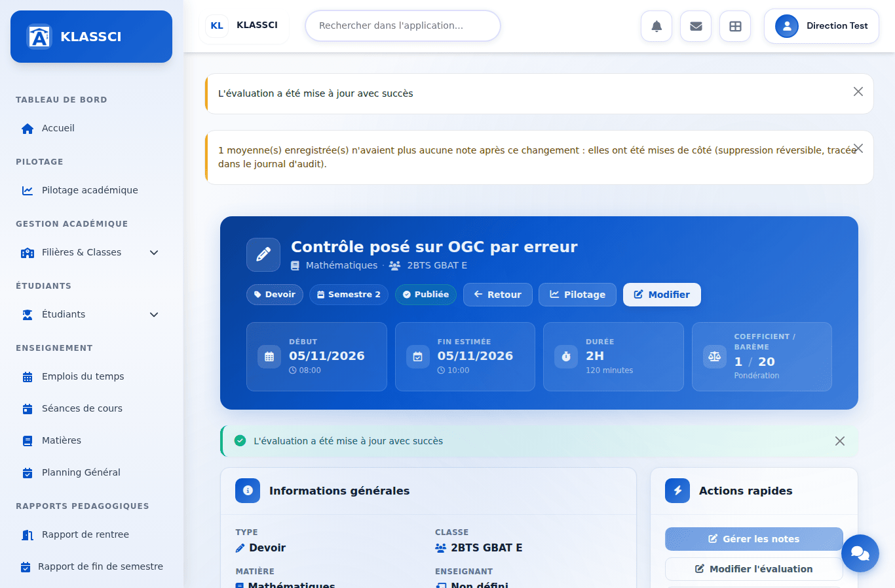

# Preuves d'exécution — déplacements de notes et moyennes enregistrées

**Branche** `claude/eloquent-wright-q09r8f` · **22 septembre 2026**

## Ce que ces preuves sont, et ce qu'elles ne sont pas

Elles viennent de l'application **réellement exécutée** — `php artisan serve`,
base MariaDB 10.11 migrée par la chaîne complète des migrations, rôles et
permissions synchronisés par `bin/deploy/fix_permissions.php`, navigateur
Chromium piloté par Playwright. Les écrans sont les vrais, les requêtes HTTP sont
les vraies.

Elles **ne** viennent **pas** d'un tenant de production : les données sont un
jeu de démonstration fabriqué pour l'occasion (deux ECUE en doublon, deux élèves
LMD, une évaluation BTS posée sur une ECUE). La moyenne à 0,00 visible sur la
capture 6 est celle d'un bulletin de démonstration jamais généré. Une validation
sur `presentation` reste à faire après déploiement.

## 1. Fusion d'ECUE — `/esbtp/lmd/reconciliation`

| capture | ce qu'elle montre |
|---|---|
|  | Deux groupes d'ECUE en doublon détectés. |
|  | Fusion bloquée (l'élément absorbé porte 2 notes) **et son impact affiché**, dont les 2 lignes de bulletin LMD : c'est sur lui que se coche « Forcer ». Avant, un refus ne montrait rien. |
|  | Le même aperçu à 400 px. |
|  | Après la fusion forcée, la fenêtre reste ouverte sur les bulletins LMD à régénérer. Le second élève porte une collision, nommée. |
|  | Le même compte rendu à 400 px, sans défilement horizontal. |
|  | Le lien d'un bulletin ouvre `/esbtp/lmd/bulletins?classe_id=1&annee_universitaire_id=1&semestre=3&search=ET-2026-014` : filtres pré-remplis. |
|  | Rôle personnalisé avec `lmd.reconciliation.manage` mais **sans** `lmd.bulletins.view` : la liste reste lisible, sans lien (`href` nul), et dit à qui la transmettre. |
|  | Le même à 400 px. |

État de `esbtp_lmd_resultats_ecues` après la fusion, relu en base :

| id | élève | élément | moyenne | note de rattrapage |
|---|---|---|---|---|
| 1 | KOUASSI | BRDM321 (conservé) | 8,00 | **12,00** — reportée depuis l'élément absorbé |
| 2 | TRAORÉ | TPRDM321 (absorbé) | 11,00 | — laissée en place : collision |
| 3 | TRAORÉ | BRDM321 (conservé) | 14,00 | — |

Aucune erreur JavaScript relevée pendant les deux parcours.

## 2. Rebascule CLI — `POST /api/cli/evaluations/{id}/matiere`

Jeton Sanctum `cli:admin`, requêtes HTTP réelles. Classe BTS « 2BTS GBAT E » ;
l'élève a 16 en Mathématiques et 4 sur un contrôle posé par erreur sur une ECUE.

| étape | réponse | `esbtp_resultats` ensuite |
|---|---|---|
| avant | — | Mathématiques 16,00 · ECUE 4,00 |
| simulation | `dry_run: true`, `notes_a_deplacer: 1` | inchangé |
| écriture | `recalculs_lances: 1`, `lignes_sans_note: [ECUE, 4]` | Mathématiques **10,00** · ECUE 4,00 (laissée, incohérente, écartée par les lecteurs) |
| Mathématiques → Physique | **refus** : « cette evaluation est deja rangee dans une matiere de son systeme » | inchangé |

## 3. Écran de modification d'une évaluation — changement de semestre

Parcours réel dans le formulaire (sélecteur premium de période, bouton
« Enregistrer les modifications »), sur la moyenne de Mathématiques :

| étape | semestre 1 | semestre 2 |
|---|---|---|
| avant | 10,00 | — |
| le devoir à 16 passe au semestre 2 | **4,00** — recalculée, le 4 y reste | **16,00** |
| le contrôle à 4 passe au semestre 2 | 4,00, **mise de côté** — plus aucune note | **10,00** |

Le message affiché après le second enregistrement : « 1 moyenne(s)
enregistrée(s) n'avaient plus aucune note après ce changement : elles ont été
mises de côté (suppression réversible, tracée dans le journal d'audit). »

## Rejouer

Les scripts (amorçage des données, parcours Playwright) ne sont pas versionnés :
ils écrivent dans une base locale dédiée. Leur recette : base MariaDB neuve
(jamais `migrate:fresh` hors `klassci_testing`), `php artisan migrate`,
`php bin/deploy/fix_permissions.php`, `APP_INSTALLED=true`, service sur le port
**8000** (sur un autre port, `AppServiceProvider::forcerLesUrlsDeBase()` préfixe
les URL par `public`). Chromium doit faire confiance à l'autorité du proxy du bac
à sable et ne passer par lui qu'en HTTPS, sans quoi Alpine et Bootstrap, servis
par CDN, ne se chargent pas.
