# Preuves d'exécution — fusion d'ECUE en doublon

**Branche** `claude/eloquent-wright-q09r8f` · **22 septembre 2026**

## Ce que ces preuves sont, et ce qu'elles ne sont pas

Elles viennent de l'application **réellement exécutée** — `php artisan serve`,
base MariaDB 10.11 migrée par la chaîne complète des migrations, rôles et
permissions synchronisés par `bin/deploy/fix_permissions.php`, navigateur
Chromium piloté par Playwright. Les écrans sont les vrais, les requêtes HTTP sont
les vraies.

Elles **ne** viennent **pas** d'un tenant de production : les données sont un
jeu de démonstration fabriqué pour l'occasion (deux ECUE en doublon, deux élèves
LMD). La moyenne à 0,00 visible sur la
capture 6 est celle d'un bulletin de démonstration jamais généré. Une validation
sur `presentation` reste à faire après déploiement.

## 1. Fusion d'ECUE — `/esbtp/lmd/reconciliation`

| capture | ce qu'elle montre |
|---|---|
| 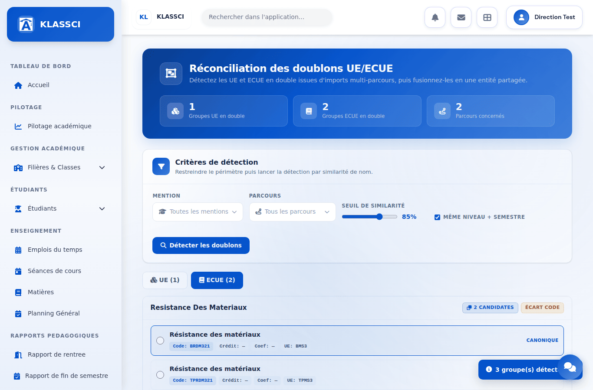 | Deux groupes d'ECUE en doublon détectés. |
| 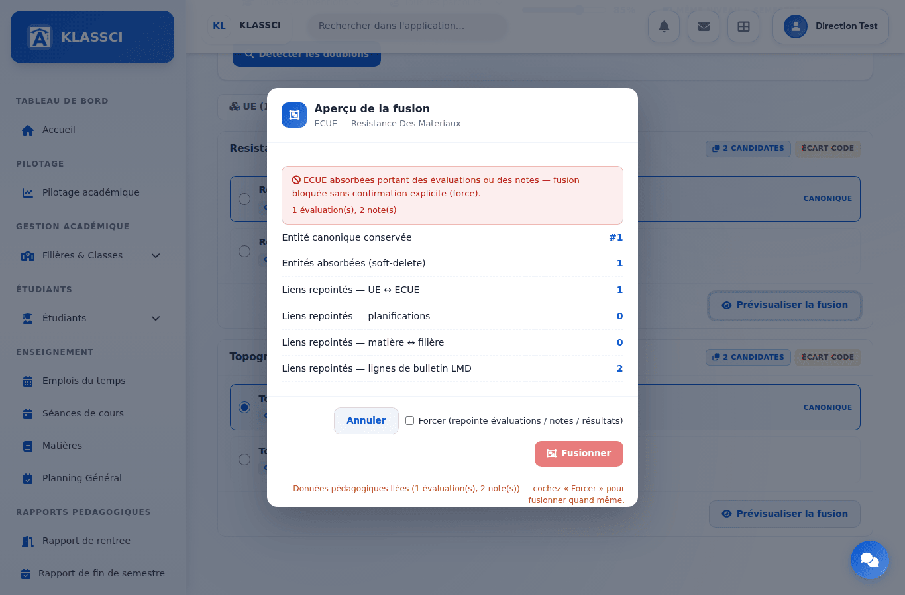 | Fusion bloquée (l'élément absorbé porte 2 notes) **et son impact affiché**, dont les 2 lignes de bulletin LMD : c'est sur lui que se coche « Forcer ». Avant, un refus ne montrait rien. |
| 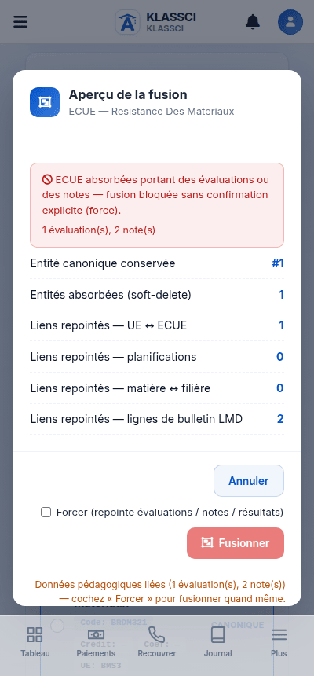 | Le même aperçu à 400 px. |
| 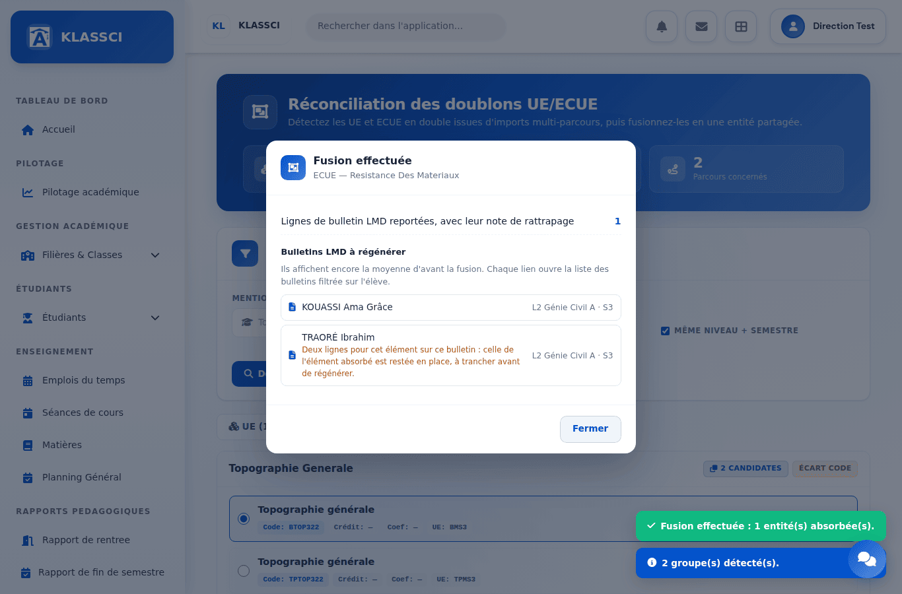 | Après la fusion forcée, la fenêtre reste ouverte sur les bulletins LMD à régénérer. Le second élève porte une collision, nommée. |
| 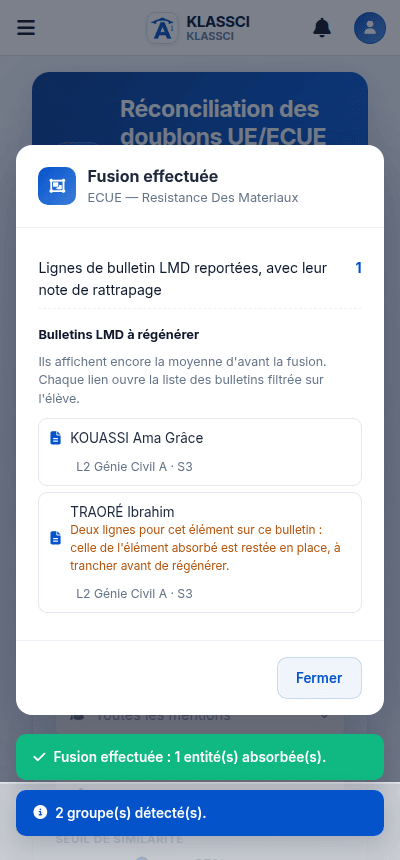 | Le même compte rendu à 400 px, sans défilement horizontal. |
| 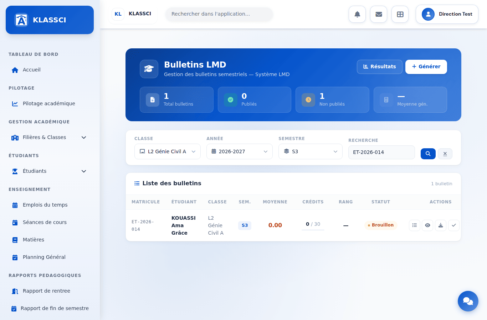 | Le lien d'un bulletin ouvre `/esbtp/lmd/bulletins?classe_id=1&annee_universitaire_id=1&semestre=3&search=ET-2026-014` : filtres pré-remplis. |
| 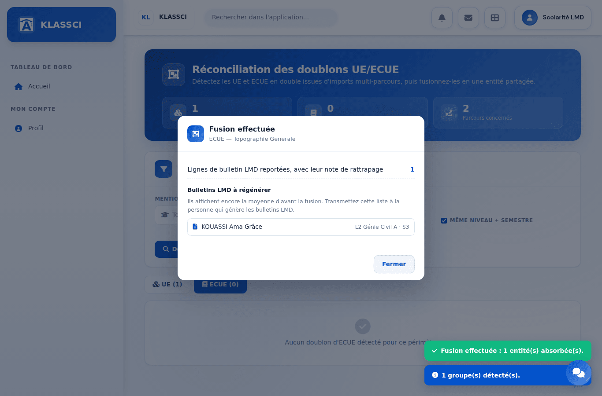 | Rôle personnalisé avec `lmd.reconciliation.manage` mais **sans** `lmd.bulletins.view` : la liste reste lisible, sans lien (`href` nul), et dit à qui la transmettre. |
| 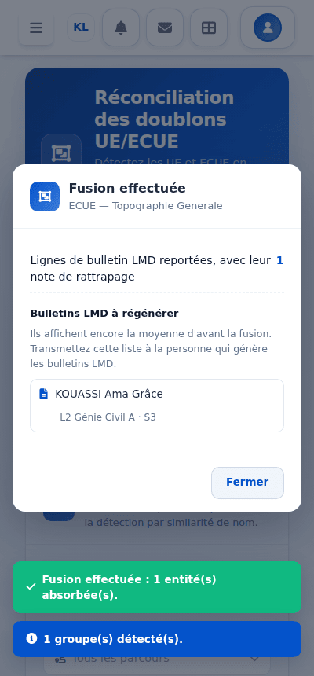 | Le même à 400 px. |

État de `esbtp_lmd_resultats_ecues` après la fusion, relu en base :

| id | élève | élément | moyenne | note de rattrapage |
|---|---|---|---|---|
| 1 | KOUASSI | BRDM321 (conservé) | 8,00 | **12,00** — reportée depuis l'élément absorbé |
| 2 | TRAORÉ | TPRDM321 (absorbé) | 11,00 | — laissée en place : collision |
| 3 | TRAORÉ | BRDM321 (conservé) | 14,00 | — |

Aucune erreur JavaScript relevée pendant les deux parcours.

## 2. Moyennes enregistrées et collision — rejoué le 23 septembre 2026

Même application locale, code de `presentation` après la fusion de #1122 et de #1145. Jeu de
données ajouté : KOUASSI a une moyenne sur les deux éléments (collision), TRAORÉ
seulement sur l'élément absorbé.

| capture | ce qu'elle montre |
|---|---|
| 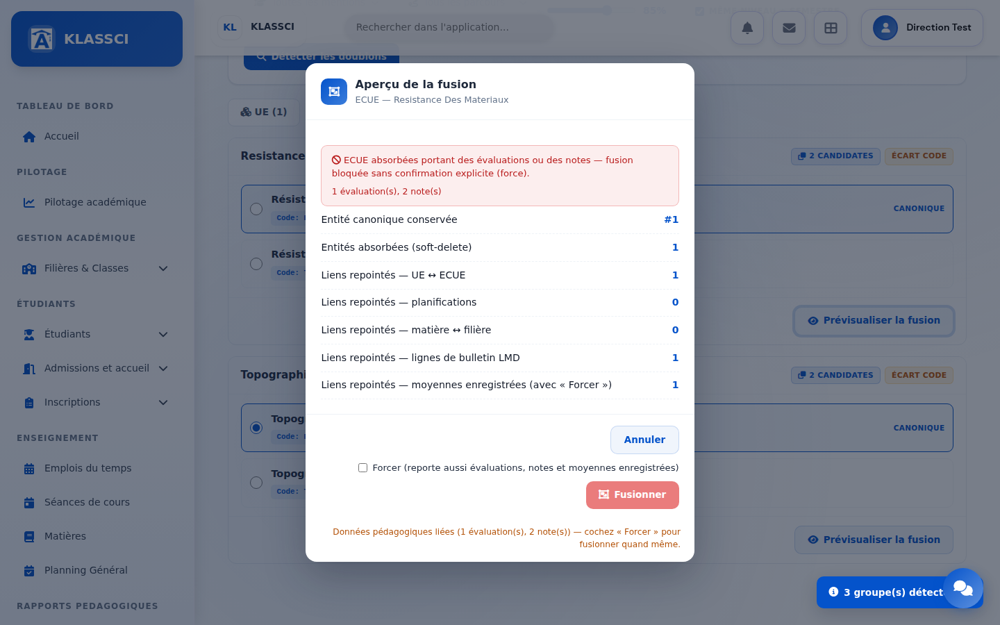 | L'aperçu annonce ce que la fusion reportera vraiment (#1145) : 1 ligne de bulletin LMD et 1 moyenne enregistrée, la ligne en collision n'étant pas comptée. Le compte rendu (capture suivante) confirme les mêmes chiffres. |
| 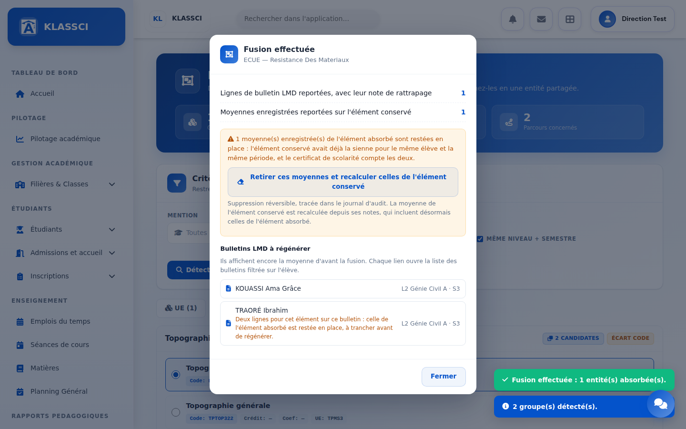 | Après la fusion : la moyenne de TRAORÉ est reportée, celle de KOUASSI est en collision, avec le bouton qui la règle. |
| 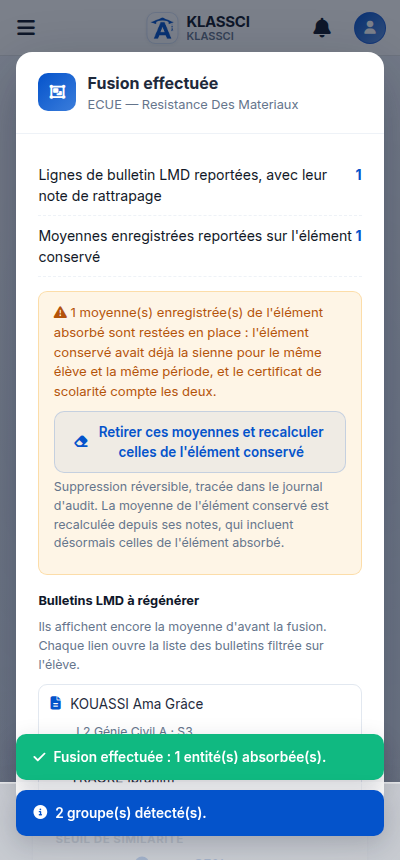 | Le même compte rendu à 400 px. |
|  | Échap et le clic à côté laissent la fenêtre ouverte ; « Fermer » demande confirmation et dit ce qui restera. |
| 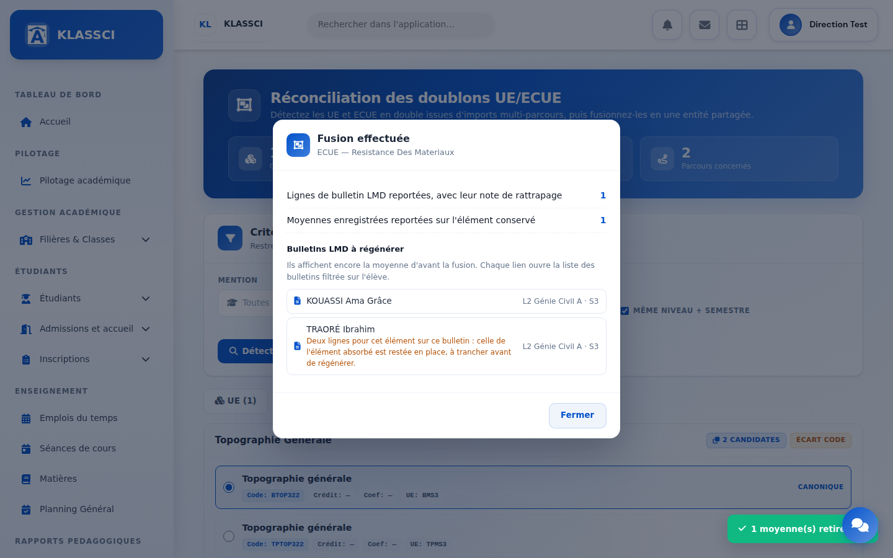 | Collision réglée : l'avertissement disparaît, « Fermer » redevient simple. |

Relu en base après le règlement : la moyenne de KOUASSI sur l'élément absorbé
est mise de côté (`deleted_at` posé), celle de l'élément conservé est recalculée
à **11,00** (8 et 14) ; celle de TRAORÉ, reportée, vaut 11,00. Aucune erreur
JavaScript.

**Défaut trouvé par cette capture, et corrigé** : l'avertissement de fermeture
était placé après la barre des boutons, sans marge basse, et tombait coupé sous
le bord de la fenêtre. Il est désormais dans la barre, au-dessus du bouton.

**Ce qui reste non prouvé** : l'instance `presentation` elle-même. Sa protection
anti-robots (« Vérification navigateur », hébergeur) renvoie 403 au navigateur
automatisé ; le déploiement y a été vérifié par l'API CLI (`pull`,
`cache/clear`, `/login` en 200), pas à l'écran.

## Ce qui n'est plus prouvé ici

Deux sections suivaient : la rebascule CLI (`POST /api/cli/evaluations/{id}/matiere`)
et le changement de semestre depuis l'écran d'une évaluation. Elles prouvaient une
implémentation de cette branche que #1132, fusionné entre-temps dans
`presentation`, a remplacée par la sienne (recalcul synchrone, moyennes laissées
et signalées au lieu d'être mises de côté). Elles ont été retirées plutôt que
laissées décrire un code qui n'existe plus. Les tests de #1132 couvrent ces
chemins ; ils n'ont pas été rejoués ici dans un navigateur.

## Rejouer

Les scripts (amorçage des données, parcours Playwright) ne sont pas versionnés :
ils écrivent dans une base locale dédiée. Leur recette : base MariaDB neuve
(jamais `migrate:fresh` hors `klassci_testing`), `php artisan migrate`,
`php bin/deploy/fix_permissions.php`, `APP_INSTALLED=true`, service sur le port
**8000** (sur un autre port, `AppServiceProvider::forcerLesUrlsDeBase()` préfixe
les URL par `public`). Chromium doit faire confiance à l'autorité du proxy du bac
à sable et ne passer par lui qu'en HTTPS, sans quoi Alpine et Bootstrap, servis
par CDN, ne se chargent pas.
