# Audit E2E — circuit LMD, émargement et paie enseignants (25 septembre 2026)

Tenant : `presentation` (démo). Connexion navigateur en super administrateur, 58 écrans capturés
(57 en HTTP 200), 8 PDF officiels rendus. Aucune écriture sur une école en production.
Limite : aucun compte enseignant de démo documenté, l'émargement côté professeur est vérifié dans le code.

Version illustrée complète : page Claude « Audit E2E LMD KLASSCI » (lien donné dans la session).

## Notes par module (confort d'un agent qui va au bout sans appeler le support)

| Module | Note | Porte | Coûte |
|---|---|---|---|
| Jury de délibération | 7 | Quorum, pré-requis, PV numéroté + code de vérification + SHA-256 | Codes bruts (`ADMIS_SOUS_CONDITION`), jury LMD sur classe BTS |
| Examens planifiés | 6 | Cohorte UEMOA, convocations, PV surveillance | Anonymat décoratif, verrou sans effet, pas de lien vers la saisie |
| Bulletins LMD | 6 | Lecture UE/ECUE, PDF officiel, relevé annuel conditionné | Bulletin vide publiable, publié à 0,00 |
| Devoirs / TP | 6 | Types Devoir, TP, Projet, Oral | Formulaire BTS (« Période »), dates au format US |
| Résultats LMD | 6 | Vue classe + live | Sélecteurs natifs, cohorte live ≠ bulletins |
| Émargement | 5 | Fenêtres début/fin, retard, appel | Délais en dur, aucune prolongation, 3 écrans admin contradictoires |
| Saisie notes LMD | 5 | Entrée par classe | 0 évaluation partout malgré des examens |
| Ajournés | 5 | Écran propre | Aucun chemin vers le rattrapage |
| Paie enseignants | 4 | ITS/CNPS paramétrables, circuit brouillon→payé | Paie l'horaire prévu, net négatif, fiche sans net |
| Rattrapage | 3 | Workflow annoncé | Session sans session d'origine → cul-de-sac |
| Soutenance | 1 | Type d'épreuve | Aucun circuit mémoire |
| Documents enseignants | 1 | Fiche complète | Aucun agrément, contrat, attestation |

## Défauts prioritaires (prouvés)

1. **Anonymat factice** — `ESBTPExamenPlanifie.is_anonymous` est le seul champ ; l'écran dit lui-même « Sans numéro d'anonymat : la saisie des notes affiche les noms ». 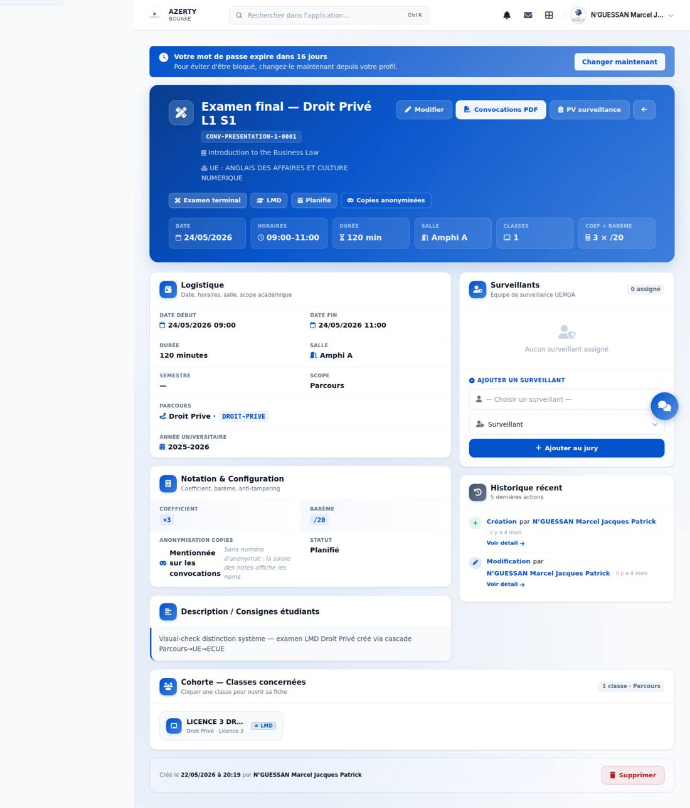
2. **Verrou des notes sans effet** — `ExamenSchedulingService::lockNotesAfterExam()` pose `notes_locked`, que rien ne lit ; l'examen n'a aucun lien vers une évaluation. Notes LMD : 0 évaluation sur 9 classes. 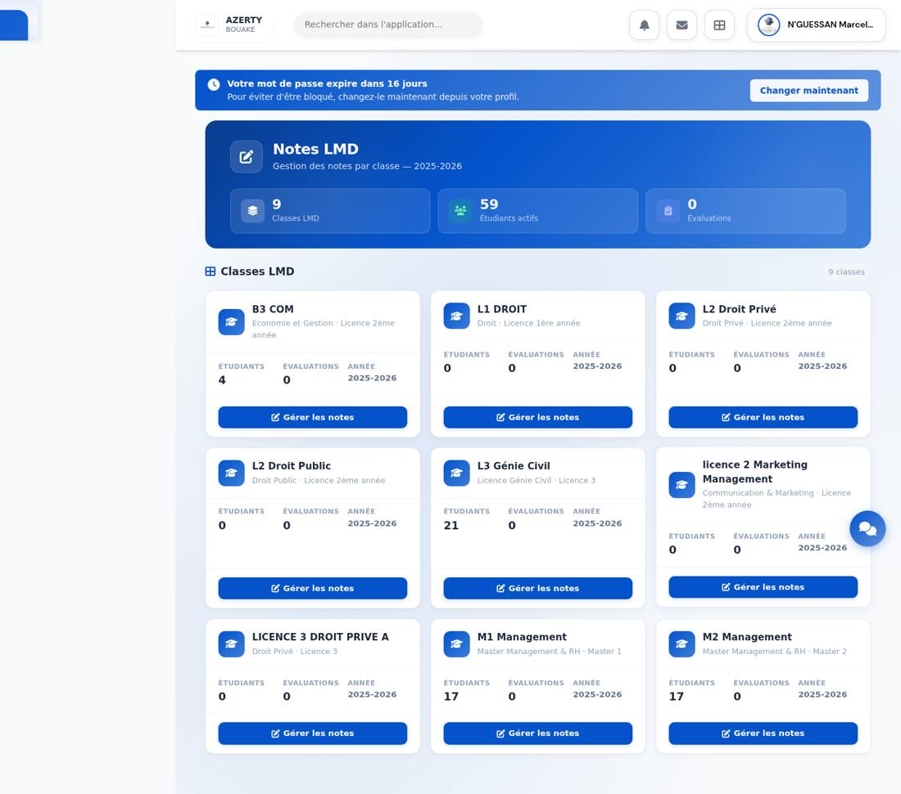
3. **Bulletin vide publiable** — bulletin 4 (S3) publié à 0,00, 0/30 crédits, PDF officiel signé. 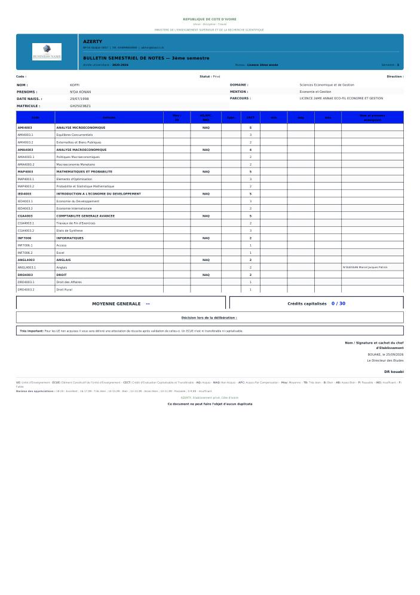
4. **Rattrapage sans session d'origine** — session 1 créée sans parent ; « Saisir les notes » → « impossible de retrouver les résultats » ; « Publier » actif avec 0 examen. 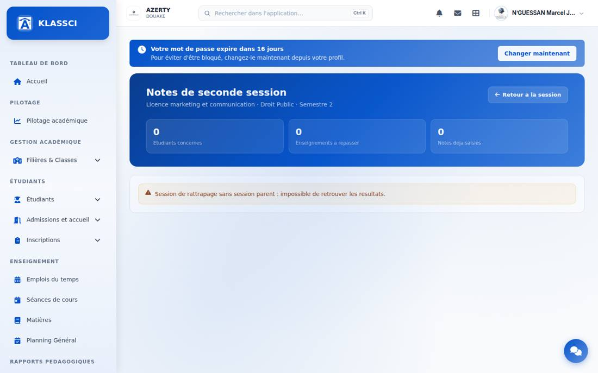
5. **Émargement rigide** — `ESBTP\TeacherAttendanceController::sign()` : +20 min présent, +45 min retard, absent auto au-delà, fin −20/+30 min, tout en littéraux ; aucune prolongation ni recours. 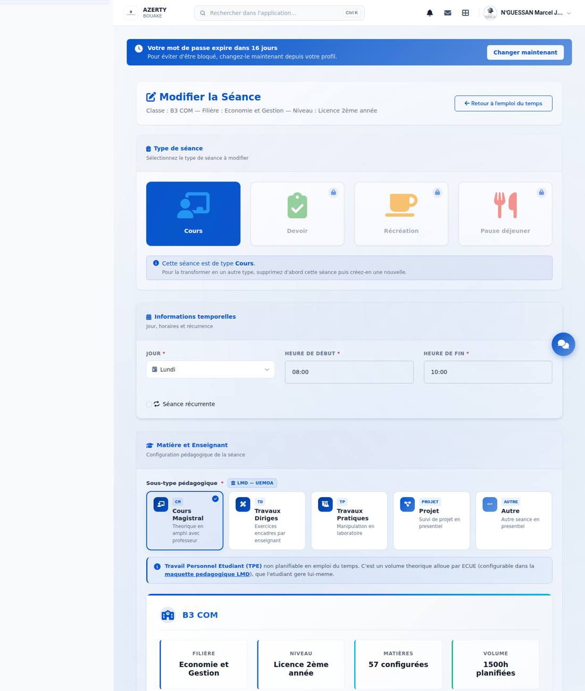
6. **Paie à l'horaire prévu** — `TeacherHoursService::dureeHeures()` paie `heure_fin − heure_debut` planifiés dès qu'un émargement existe ; 40 min de retard payées pleines.
7. **Net négatif validable, fiche sans net** — `PayrollComputationService::computePreview()` : `net = brut − retenues` sans plancher ; PDF sans ligne « Net à payer », marges nulles. 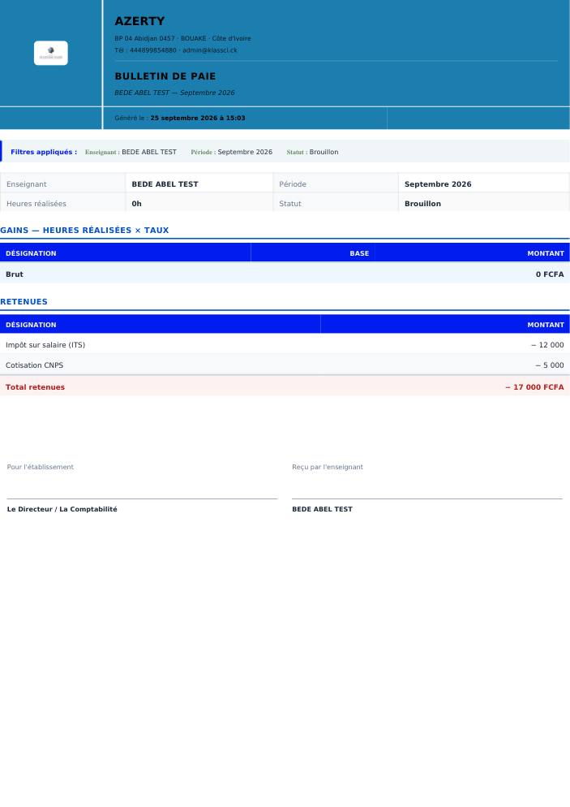

## Incohérences et frictions

- « Année — » dans les bandeaux Jurys et Rattrapage. 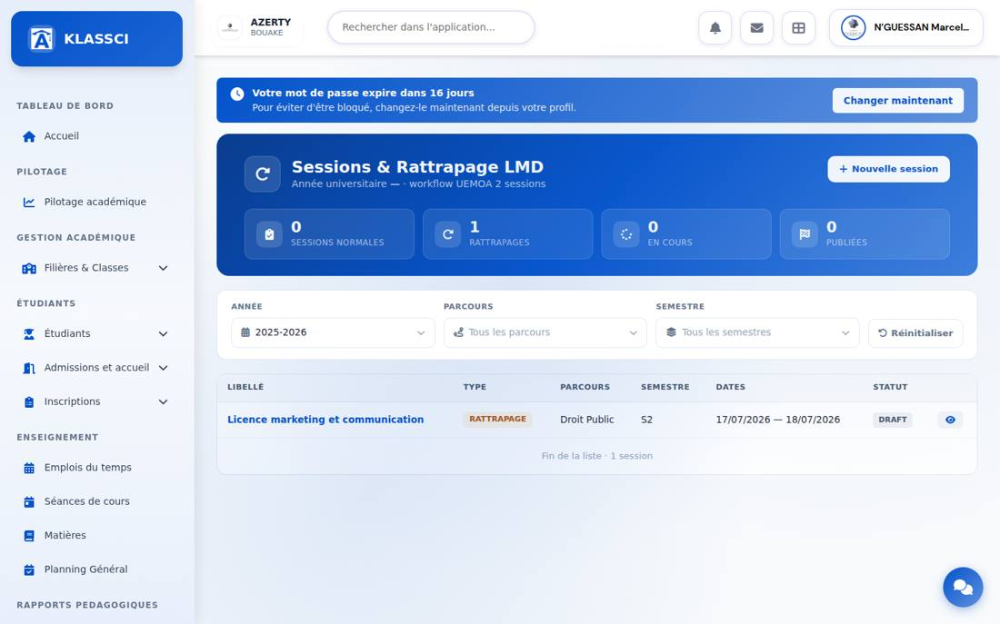
- Délibération : décisions et mentions en codes bruts ; jury publié affiché en rouge « rectification atomique requise ». 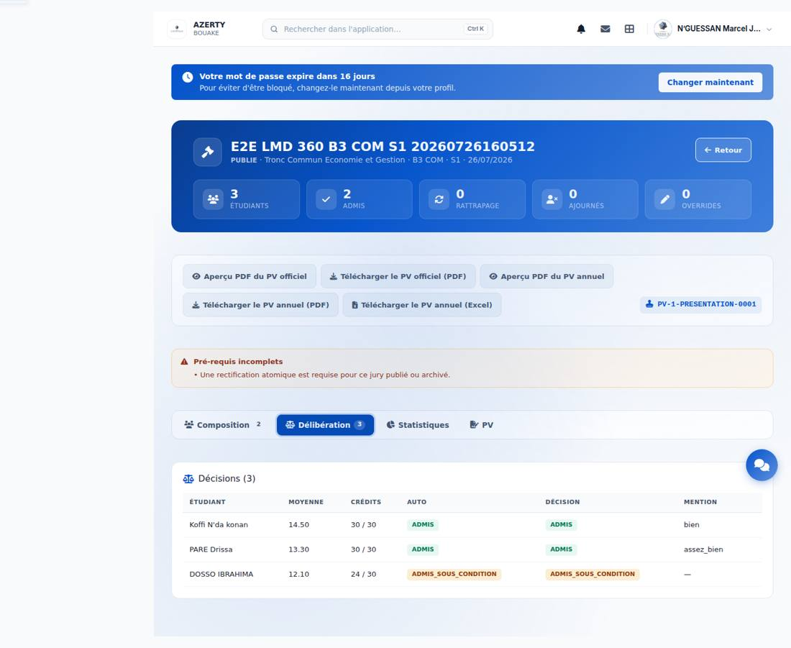
- Jury LMD rattaché à « 1BTS IG A » : aucune garde de système.
- Rapport d'émargement : en-tête violet (hors charte), ligne « VALIDÉ » mais 0 % validé, « N/A » en heure d'arrivée. 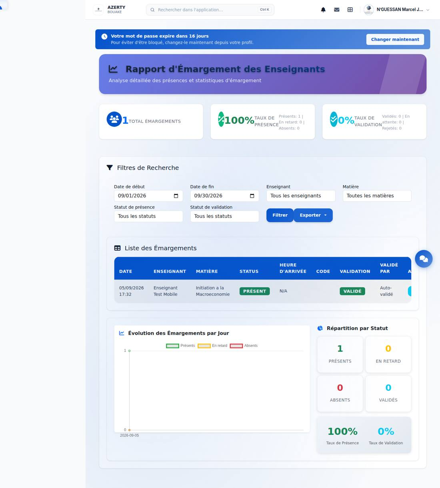
- Planning → Émargement : 170 séances / 330 h mais « 0 matière », « 0 enseignant actif ». 
- Deux modales empilées à la connexion (« Nouveautés » + « Expiration imminente »). 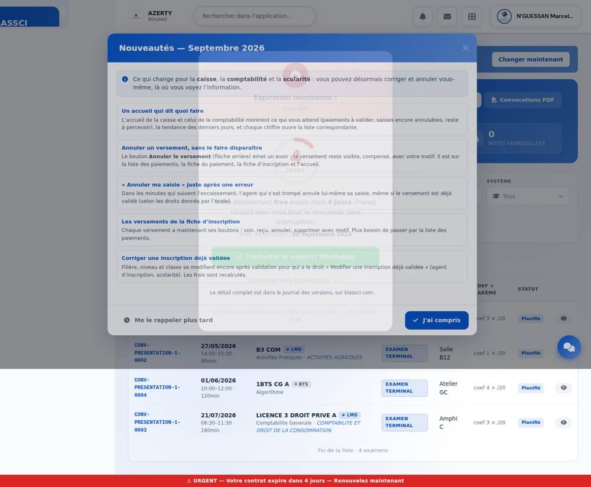
- Sélecteurs natifs : Résultats classe, Générer un bulletin, Nouvel examen (UE/ECUE).
- Examen « Droit Privé L1 S1 » rattaché à une Licence 3, semestre vide ; bouton « Ajouter au jury » dans le bloc Surveillants.

## Navigation cassée

| Depuis | Vers | Aujourd'hui |
|---|---|---|
| Examen | sa feuille de notes | aucun lien |
| Ajournés | rattrapage | seul lien : Jurys |
| Jury publié | bulletins | aucun lien |
| Rapport d'émargement | paie du mois | aucun lien |
| Fiche enseignant | fiches de paie, documents | aucun onglet |

## Priorités

1. Garde de publication des bulletins (pas de bulletin sans note, sauf dérogation motivée).
2. Paie : refuser le net négatif, imprimer le net, puis payer l'heure réelle (début→fin émargés, plafonnée ; réglage d'école planifiée/réelle).
3. Rattrapage : session d'origine obligatoire, « Inscrire au rattrapage » depuis les ajournés, « Publier » bloqué sans examen.
4. Examen → évaluation ECUE créée automatiquement ; verrou appliqué à la saisie ; lien « Saisir les notes ».
5. Anonymat réel : numéros par copie sur les convocations, saisie par numéro, levée tracée par une personne habilitée.
6. Prolongation de séance : demande par l'enseignant, décision par la personne habilitée avec contrôle de la séance suivante (salle, classe, enseignant) ; délais 20/45/30 en réglages ; justification de retard.
7. Documents enseignants : agrément/diplômes avec expiration, attestations d'heures et de service fait, contrat de vacation, vérifiables comme le PV.
8. Soutenances : sujet, directeur, autorisation, dépôt, planification sans conflit, jury, PV, report de note.
9. Finition : libellés français, « Année — », un seul écran d'émargement, sélecteurs premium, une modale à la fois.

## Références

- [Vademecum jury et examens, Université de Lille](https://droit.univ-lille.fr/filedroit/user_upload/Vademecum_jury_et_examens_23-24.pdf)
- [Charte des examens, Aix-Marseille Université](https://www.univ-amu.fr/system/files/2018-09/DEVE-HANDI-charte_des_examens.pdf)
- [OSE, paiement des vacataires — Campus Matin](https://www.campusmatin.com/numerique/equipements-systemes-informations/une-application-open-source-pour-reduire-les-delais-de-paiement-des-vacataires.html)
- [Procédure de soutenance de master, Université de Sétif](https://www.univ-setif.dz/externe/Soutenance-Master.pdf)

---

# Seconde passe (même jour) : utilisation réelle, téléphone, compte enseignant

## Urgent — sécurité production

Le mode débogage est actif sur **esbtp-abidjan** et **ephrata** (et presentation) : une adresse inexistante,
appelée sans connexion, renvoie la trace Laravel complète avec le chemin serveur. yakro, islg, usat : corrects.
Correction : `APP_DEBUG=false` dans le `.env` de chaque serveur, puis `config:clear`. Rien n'a été modifié.

## Défauts prouvés en utilisant l'application

| # | Défaut | Preuve |
|---|---|---|
| 1 | « 1,5 » saisi en note LMD est enregistré **15** (virgule ignorée par le champ numérique ; dépend de la langue du navigateur) | 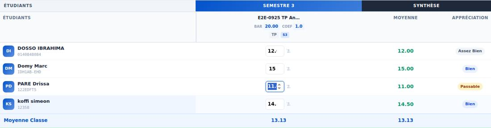 |
| 2 | Notes refusées par le serveur (25/20, −3) gardées dans la grille, comptées dans la moyenne (40,38/20) et présentées « en attente réseau » | 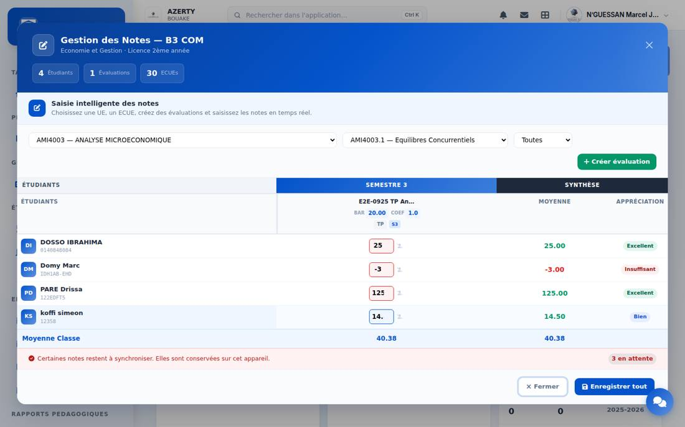 |
| 3 | Saisie LMD en brouillon sans validation ; bulletin exige des fiches validées dans Pilotage (message pointant vers Notes LMD) ; Pilotage limité à S1/S2/Annuel |  |
| 4 | Bulletin officiel généré sur une note brouillon : moyenne 8,50, rang 1/1 sur 1 matière / 19 | 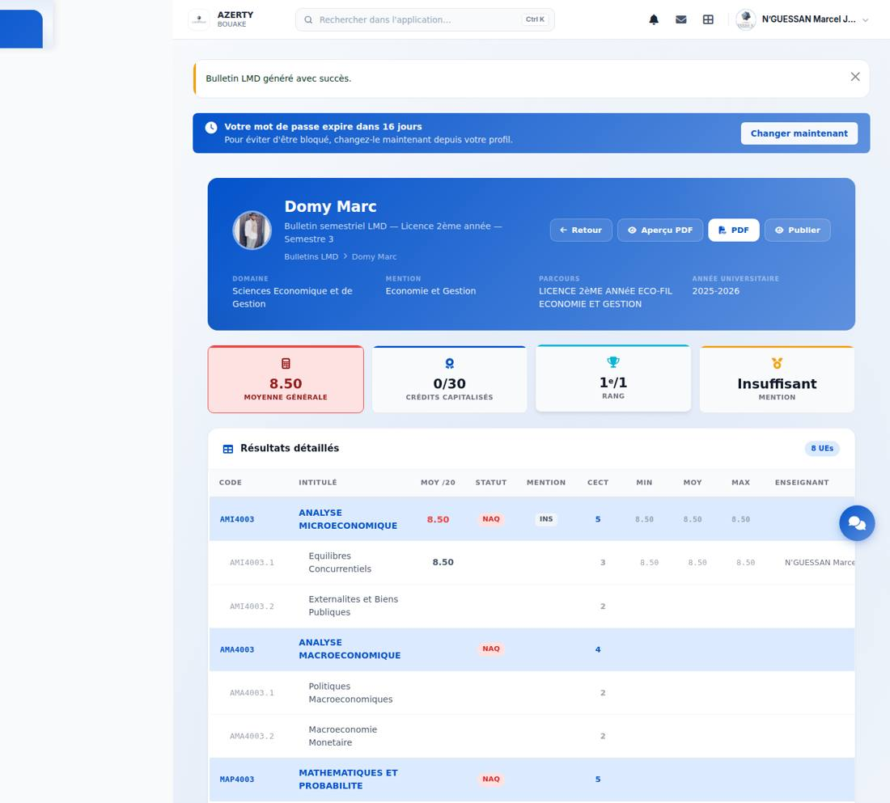 |
| 5 | Jury : 4 décisions écrites sans quorum (`readiness.ok=false`), `DEFERE` pour les dossiers vides, cohorte fausse, passage « en cours » | 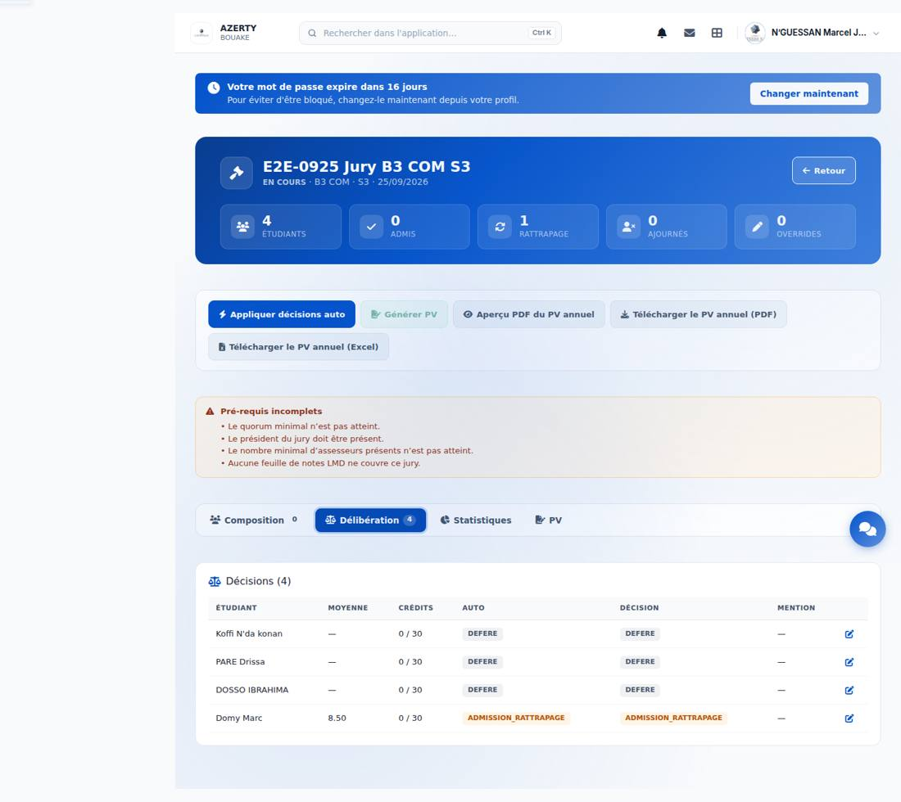 |
| 6 | Enseignant : fenêtre de saisie du code d'émargement sous le fond grisé → clic impossible | 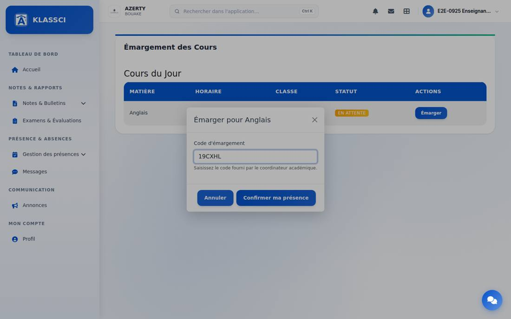 |
| 7 | Nouvel enseignant indisponible partout par défaut, bouton « Gérer les enseignants » caché, alerte native, grille limitée à 17 h, absent de la paie sans taux |  |
| 8 | Absent d'office à +45 min côté enseignant, affiché « EN RETARD » côté administration (`admin/attendance/index.blade.php:116`), compteur « En retard 0 » | 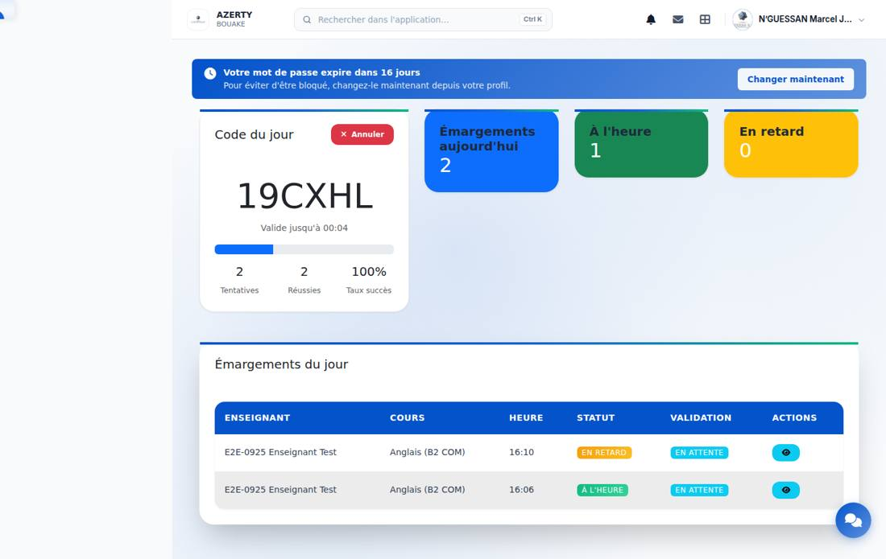 |
| 9 | Trois rappels empilés sur le formulaire de séance ; popups sur le changement de mot de passe imposé | 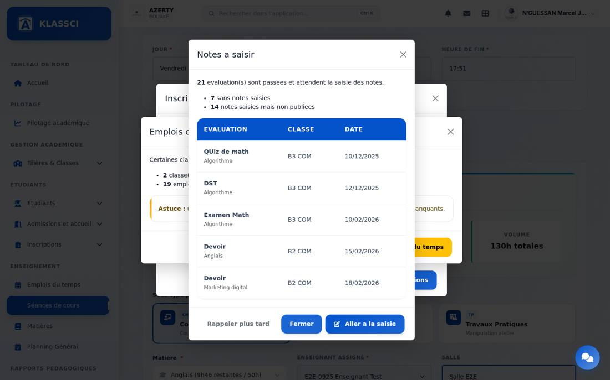 |
| 10 | Même mot de passe de départ pour tous les comptes sans réglage (`UserService::defaultPassword()`) ; changement forcé à la 1re connexion | code |
| 11 | 8 classes LMD sur 9 de la démo inutilisables (sans étudiant ou sans UE) | — |
| 12 | Jury : classes BTS proposées, semestres limités à S8 (pas de jury M2) ; heures inversées → 1 320 min | — |

Bien fait : contrôle de conflit (enseignant + salle + classe) à la création de séance — brique prête pour la prolongation ;
écran « Gestion de la séance » en 5 étapes ; contrôle avant génération des bulletins avec motif écrit ; refus serveur des notes hors barème.

## Écrans à refaire (balayage 106 pages, ordinateur + téléphone)

Téléphone : fiche enseignant (textes superposés), jury (page de 532 px sur 390), émargements admin (blocs colorés, tableau coupé),
rapport d'émargement (violet). Ordinateur : présences, rapport de présence, codes d'émargement, années universitaires,
annonces, frais, disponibilités enseignant, tableau de bord enseignant, fiche de paie PDF. Partout sur téléphone :
rappel mot de passe = ¼ d'écran, tableaux larges tronqués.

 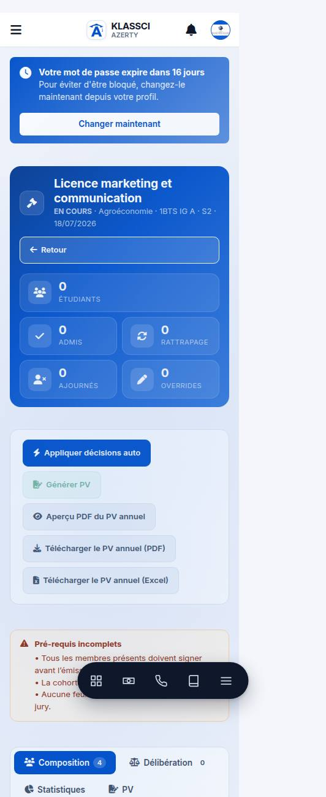  

## Données de test créées sur presentation (préfixe E2E-0925)

Évaluation TP 86 + 4 notes brouillon (B3 COM) ; bulletin S3 de Domy Marc régénéré ; jury 4 et ses 4 décisions ;
enseignant n° 20 « E2E-0925 Enseignant Test » (associé à Anglais B2 COM, dispo vendredi 15-17 h) ; séances 368 et 369,
deux émargements, un code du jour.
