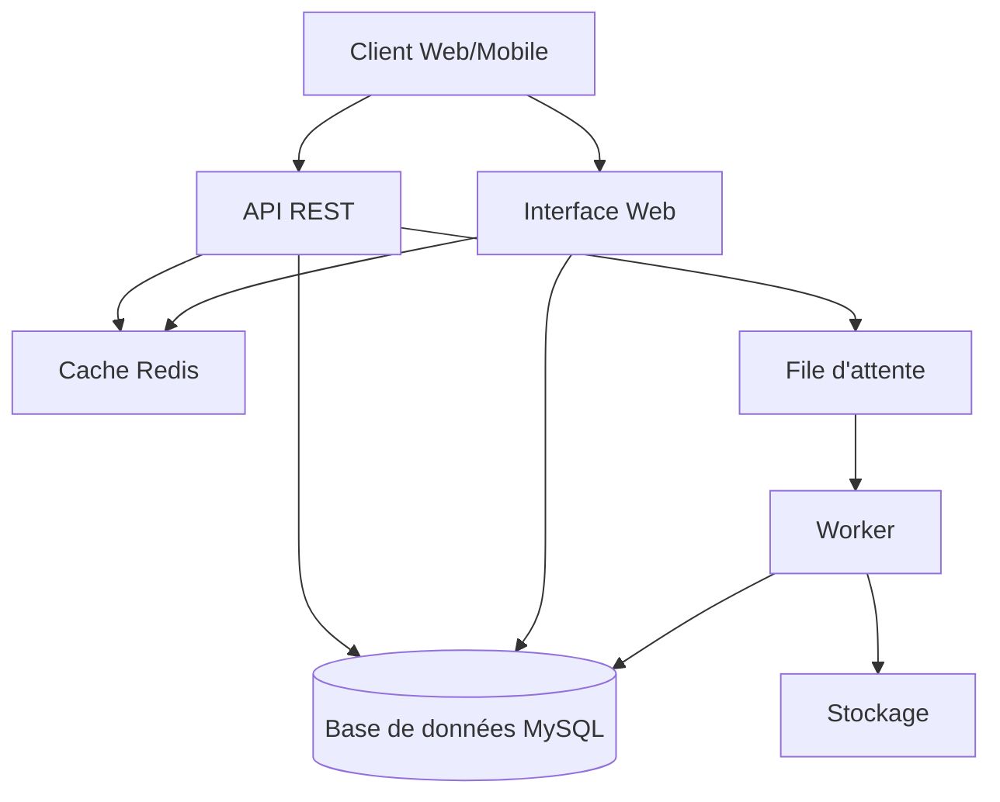
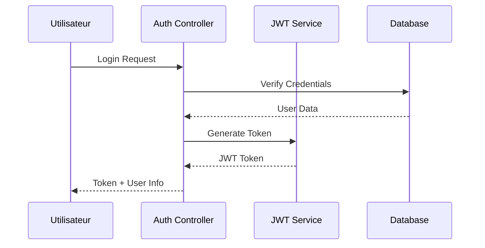
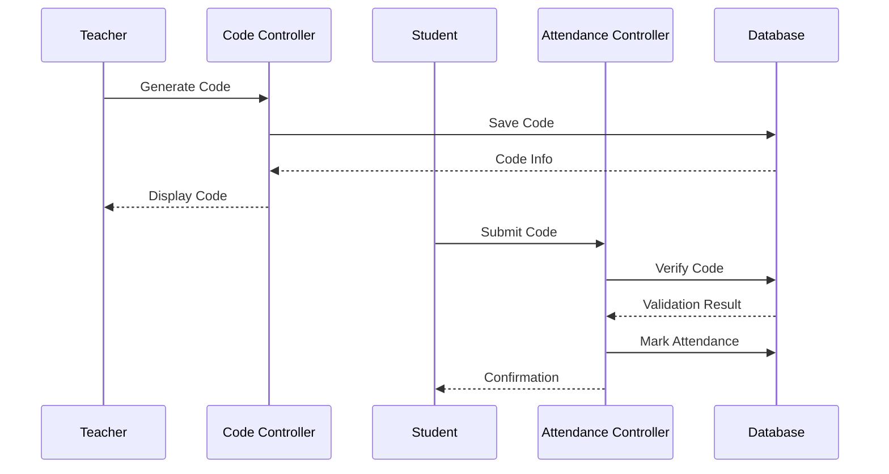
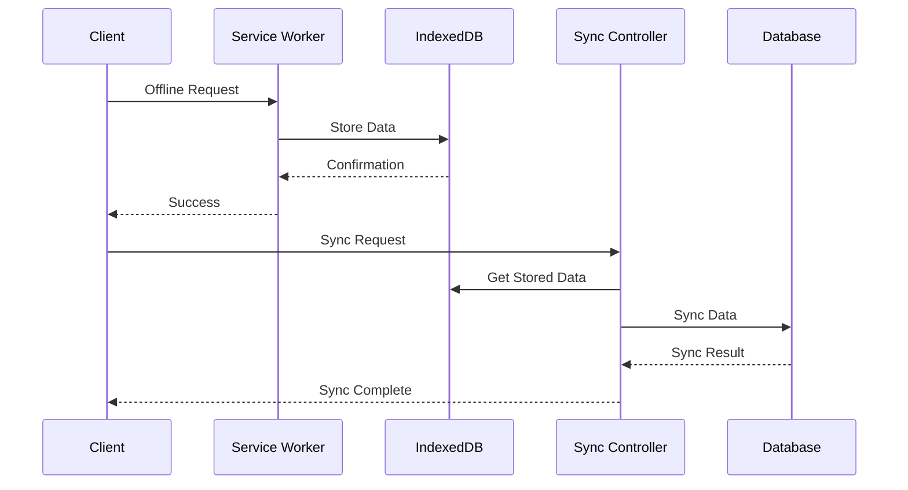

# Documentation Architecture - ESBTP Système de Suivi des Présences

## Vue d'ensemble

Le système de suivi des présences ESBTP est une application web construite avec Laravel, utilisant une architecture MVC avec des composants supplémentaires pour la gestion hors ligne et la synchronisation.

## Architecture Globale

## Composants Principaux

### 1. Frontend

#### Interface Web

-   Framework : Laravel Blade + Bootstrap
-   JavaScript : Vue.js pour les composants dynamiques
-   Service Worker pour le mode hors ligne
-   IndexedDB pour le stockage local

#### Application Mobile

-   PWA (Progressive Web App)
-   Responsive Design
-   Gestion du mode hors ligne

### 2. Backend

#### API REST

-   Laravel API Resources
-   JWT Authentication
-   Rate Limiting
-   Validation des requêtes

#### Base de Données

-   MySQL pour le stockage principal
-   Redis pour le cache
-   Migrations Laravel

#### File d'Attente

-   Laravel Queue
-   Redis comme driver
-   Gestion des tâches asynchrones

## Modules Fonctionnels

### 1. Module d'Authentification

### 2. Module de Présence

### 3. Module Hors Ligne

## Sécurité

### Authentification

-   JWT pour l'API
-   Sessions Laravel pour l'interface web
-   Middleware d'authentification
-   Protection CSRF

### Autorisation

-   Rôles et permissions
-   Middleware d'autorisation
-   Validation des accès

### Protection des Données

-   Encryption des données sensibles
-   Validation des entrées
-   Protection XSS
-   Rate limiting

## Performance

### Mise en Cache

-   Cache de configuration
-   Cache de requêtes
-   Cache de vues

### Optimisation

-   Compression des assets
-   Minification du code
-   Lazy loading des images
-   Pagination des résultats

## Déploiement

### Infrastructure

-   Serveur web : Nginx
-   PHP-FPM
-   MySQL
-   Redis
-   Supervisord pour les workers

### Environnements

-   Développement
-   Test
-   Production

## Monitoring

### Logs

-   Laravel Log
-   Error tracking
-   Audit trail

### Métriques

-   Temps de réponse
-   Utilisation des ressources
-   Taux d'erreur

## Maintenance

### Sauvegardes

-   Base de données
-   Fichiers uploadés
-   Configuration

### Mises à jour

-   Procédure de déploiement
-   Rollback
-   Tests automatisés
