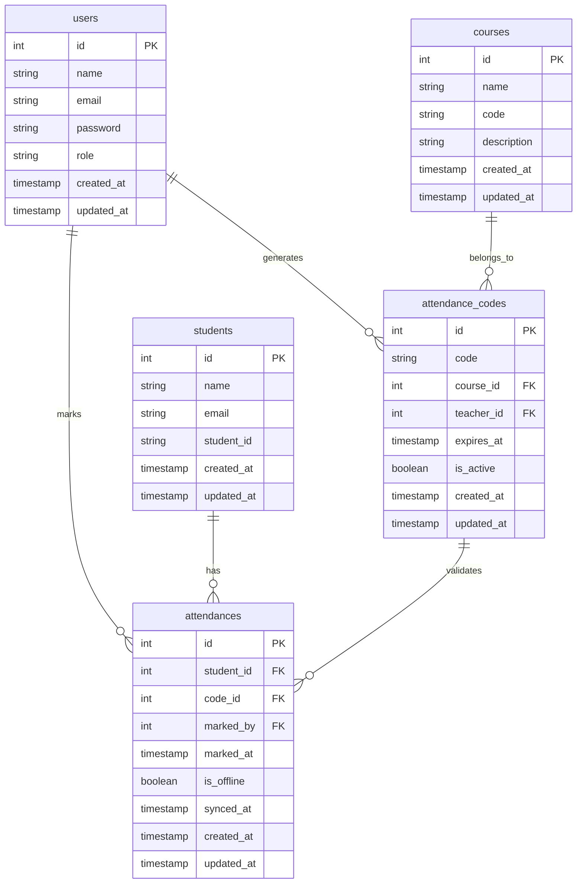

# Documentation Base de Données - ESBTP Système de Suivi des Présences

## Vue d'ensemble

Cette documentation détaille la structure de la base de données du système de suivi des présences ESBTP. Le système utilise MySQL comme système de gestion de base de données.

## Schéma de la Base de Données

## Tables

### users

Table des utilisateurs du système (administrateurs, enseignants, secrétaires).

| Colonne    | Type         | Description                     |
| ---------- | ------------ | ------------------------------- |
| id         | INT          | Clé primaire                    |
| name       | VARCHAR(255) | Nom complet                     |
| email      | VARCHAR(255) | Email unique                    |
| password   | VARCHAR(255) | Mot de passe hashé              |
| role       | ENUM         | 'admin', 'teacher', 'secretary' |
| created_at | TIMESTAMP    | Date de création                |
| updated_at | TIMESTAMP    | Date de mise à jour             |

### students

Table des étudiants.

| Colonne    | Type         | Description         |
| ---------- | ------------ | ------------------- |
| id         | INT          | Clé primaire        |
| name       | VARCHAR(255) | Nom complet         |
| email      | VARCHAR(255) | Email unique        |
| student_id | VARCHAR(50)  | Numéro étudiant     |
| created_at | TIMESTAMP    | Date de création    |
| updated_at | TIMESTAMP    | Date de mise à jour |

### courses

Table des cours.

| Colonne     | Type         | Description         |
| ----------- | ------------ | ------------------- |
| id          | INT          | Clé primaire        |
| name        | VARCHAR(255) | Nom du cours        |
| code        | VARCHAR(50)  | Code du cours       |
| description | TEXT         | Description         |
| created_at  | TIMESTAMP    | Date de création    |
| updated_at  | TIMESTAMP    | Date de mise à jour |

### attendance_codes

Table des codes de présence.

| Colonne    | Type        | Description              |
| ---------- | ----------- | ------------------------ |
| id         | INT         | Clé primaire             |
| code       | VARCHAR(10) | Code de présence         |
| course_id  | INT         | Référence au cours       |
| teacher_id | INT         | Référence à l'enseignant |
| expires_at | TIMESTAMP   | Date d'expiration        |
| is_active  | BOOLEAN     | État du code             |
| created_at | TIMESTAMP   | Date de création         |
| updated_at | TIMESTAMP   | Date de mise à jour      |

### attendances

Table des présences.

| Colonne    | Type      | Description               |
| ---------- | --------- | ------------------------- |
| id         | INT       | Clé primaire              |
| student_id | INT       | Référence à l'étudiant    |
| code_id    | INT       | Référence au code         |
| marked_by  | INT       | Référence à l'utilisateur |
| marked_at  | TIMESTAMP | Date de marquage          |
| is_offline | BOOLEAN   | Marquage hors ligne       |
| synced_at  | TIMESTAMP | Date de synchronisation   |
| created_at | TIMESTAMP | Date de création          |
| updated_at | TIMESTAMP | Date de mise à jour       |

## Index

### users

-   `email_index` sur `email` (UNIQUE)
-   `role_index` sur `role`

### students

-   `email_index` sur `email` (UNIQUE)
-   `student_id_index` sur `student_id` (UNIQUE)

### attendance_codes

-   `code_index` sur `code` (UNIQUE)
-   `course_teacher_index` sur `(course_id, teacher_id)`
-   `expires_at_index` sur `expires_at`

### attendances

-   `student_code_index` sur `(student_id, code_id)` (UNIQUE)
-   `marked_at_index` sur `marked_at`
-   `synced_at_index` sur `synced_at`

## Contraintes

### Clés Étrangères

-   `attendance_codes.course_id` → `courses.id`
-   `attendance_codes.teacher_id` → `users.id`
-   `attendances.student_id` → `students.id`
-   `attendances.code_id` → `attendance_codes.id`
-   `attendances.marked_by` → `users.id`

### Autres Contraintes

-   Les codes de présence doivent être uniques
-   Les emails doivent être uniques
-   Les numéros étudiants doivent être uniques
-   Un étudiant ne peut pas marquer sa présence deux fois avec le même code

## Maintenance

### Sauvegardes

-   Sauvegardes quotidiennes à 02:00
-   Rétention de 30 jours
-   Stockage hors site

### Performance

-   Optimisation des index régulière
-   Nettoyage des vieux codes de présence
-   Archivage des données anciennes

## Migrations

Les migrations sont gérées avec Laravel Migrations. Voir le dossier `database/migrations` pour les détails.
